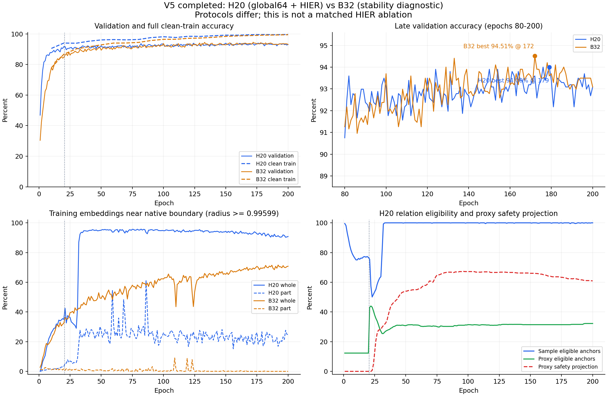

# V5 完整训练结果与诊断

日期：2026-10-03。只读检查两组现有结果；未重跑测试，未启动新实验。

## 1. 完成状态与结果身份

两组均已完成 **200 epoch × 200 step = 40000 个优化步**，各有完整的 200 份逐轮指标、best / last 权重及每 20 轮归档。两组均在结束后用验证选中的 best 评估一次全部 2468 个正式测试样本。

- 运行目录标识：`hier_proxy_v5_20261003_1347`，子组 `H20` / `B32`。服务器绝对路径留在私有记录中。
- 生产代码：`6e13ff9f59ad3bec8f7c3db857e6558e37473c03`。
- seed=22，固定 8856 训练 / 984 验证实例；两组随机初始模型相同。
- H20：双卡、全局 64 例、类别均匀有放回、CE/intra/inter；前 20 轮 base-only，第 21 轮起 HIER 权重 0.5。
- B32：单卡、实例打乱无放回、每轮使用前 6400 例、CE/intra。
- 配置和评估规则见 [启动记录](17_V5_TRAINING_START_2026-10-03.md)。

| 指标 | H20：双卡联合训练 | B32：单卡稳定性诊断 |
|---|---:|---:|
| 最佳验证 OA / 所选 epoch | 94.0041% / 179 | 94.5122% / 172 |
| 所选模型的验证 AA | 90.7432% | 91.4077% |
| 所选模型的正式 test OA | **92.1394%** | **92.5851%** |
| 所选模型的正式 test AA | 89.1581% | 89.3285% |
| 所选模型的 test 平滑 CE | 2.99697 | 2.99425 |
| epoch200 验证 OA | 93.0894% | 93.0894% |
| 总墙钟时间 | 6 小时 39 分 25 秒 | 5 小时 54 分 36 秒 |
| 结束时间，北京时间 | 2026-10-03 20:30:04 | 2026-10-03 19:45:13 |

H20 比 B32 的 test OA 低 **0.4457 个百分点**，对应少正确 11 个测试实例。上述 test 不是第 200 轮模型的成绩：H20 测试的是第 179 轮，B32 是第 172 轮。

已从测试混淆矩阵重算 OA/AA：OA 与记录一致；H20 AA 的浮点累计差小于 0.00001 个百分点。

所选权重 SHA256：

- H20 `best.pth`：`cb9dd927e32438d59a4425d16912a0d90d4ca28cf9dcf50664df8a195c707a94`。
- B32 `best_checkpoint.pth`：`7d6a2194220f64ec48fb6fac71c410f327aa573e0d190a472f02681c08348b00`。

## 2. 训练稳定性恢复，但泛化差距仍在

| 后期指标 | H20 | B32 |
|---|---:|---:|
| best 到 epoch200 验证 OA 回落 | 0.9146 个百分点 | 1.4228 个百分点 |
| 后 20 轮验证 OA，均值 ± 标准差 | 93.1098% ± 0.3770 | 93.4350% ± 0.3089 |
| 后 40 轮验证 OA，均值 ± 标准差 | 93.2419% ± 0.4097 | 93.5467% ± 0.3363 |
| epoch200 训练模式采样 OA | 99.3594% | 98.4844% |
| epoch200 无增强完整训练集 eval OA | 99.6161% | 99.4354% |
| epoch200 完整训练集 eval 与验证 OA 差 | 6.5266 个百分点 | 6.3460 个百分点 |

这次没有再现 V4 的后期大幅推理退化：V4 B0 末轮验证 OA 为 78.35%，完整训练集 clean eval 也下降到 81.37%；本轮两组末期训练集推理均接近 99.5%，验证维持约 93%。

现在更符合**训练集继续拟合、验证进入平台并存在泛化差距**的表现。仍不能称为“没有过拟合”，但不应再把 V4 的输入/BN 推理退化与本轮普通泛化差距混作同一个问题。

表中的后期标准差是同一 seed 内逐轮波动，不是跨 seed 的性能不确定性。

## 3. 覆盖率：单轮不全覆盖，长期没有永久漏用实例

| 覆盖指标 | H20 | B32 |
|---|---:|---:|
| 每轮 draw | 12800 | 6400 |
| 200 轮总 draw | 256 万 | 128 万 |
| 单轮唯一实例覆盖率均值 | 66.0768% | 72.2674% |
| 单轮覆盖率范围 | 65.3681%–66.9828% | 固定 72.2674% |
| 最大类 chair 的单轮覆盖均值 | 32.948% | 实例均匀抽样协议 |
| 累计覆盖全部 8856 个实例的首轮 | 21 | 7 |
| epoch200 唯一实例数 | 5814 | 6400 |

H20 的类别均匀抽样让大小类获得接近的 draw 数，大类的单轮实例覆盖因此较低。增加到 200 步没有实现 80%–90% 的大类覆盖，但所有训练实例在长期过程中都已使用；不能解释为整个训练期间漏掉了某些实例。

双卡任务总时间是单卡的约 **1.126 倍**，没有变成两倍。H20 每轮处理的实例数本来就是 B32 的两倍，而且多了 HIER 和双卡通信；这不是相同计算量的加速比。

## 4. 小类：零准确率消失，flower_pot 仍明显困难

| 正式 test 类别 | H20 | B32 | 样本数 |
|---|---:|---:|---:|
| door | 100% | 95% | 20 |
| flower_pot | **20%（4/20）** | **5%（1/20）** | 20 |
| dresser | 76.7442% | 88.3721% | 86 |
| table | 76% | 73% | 100 |
| plant | 85% | 88% | 100 |

两组测试集均没有 0% 准确率类别。H20 相对 B32 有 15 类提高、13 类降低、12 类相同；整体 OA 没有显示增益，局部类别也并非一致改善。

flower_pot 的失败具有明确的泛化成分：

- H20 第 200 轮该类 clean train 为 100%，验证为 46.67%；最佳验证选中模型的 test 为 20%。测试误判为 plant 11 例、vase 5 例。
- B32 第 200 轮 clean train 为 80.60%，验证为 40%；最佳模型的 test 为 5%。误判为 plant 13 例、vase 5 例、cup 1 例。
- 该类训练 / 验证 / 测试分别 134 / 15 / 20 例。H20 的 15 个百分点测试提高只对应 3 例，不能作为稳健类内层次收益的证据。

上述第 200 轮 train/val 与最佳模型 test 属于不同 checkpoint，不能作为同一模型的精确 gap；它们用于说明该类的持续困难。完整逐类表见 [测试类别摘要](artifacts/v5_final_2026-10-03/class_test_summary.csv)。

## 5. HIER：sample 关系已充分，proxy 关系和几何更值得查

后 40 轮均指 epoch161–200，比例按原始计数汇总。

| HIER 指标 | sample 图，后 40 轮 | proxy 图，后 40 轮 |
|---|---:|---:|
| 合格 anchor 位置比例 | **99.926%** | **31.647%** |
| pair / triple 选同一代理的碰撞率 | 0.299% | 0.322% |
| 非碰撞三元组中至少一个 hinge 活跃 | 5.796% | 1.585% |
| 当前候选三元组域覆盖率 | 6.309% | 0.557% |
| 实际抽取中的重复率 | 3.191% | 0.301% |

第 200 轮 sample anchor 为 100%，proxy anchor 为 32.227%，即平均每批 512 个 proxy 中 165 个可作为合格 anchor。proxy 任意角色覆盖仍为 100%；低 anchor 比例不等于其它代理完全没有梯度或永远不使用。

当前 sample 合格率已不是主要瓶颈，碰撞也没有大量置零三元组。候选域覆盖率是各 batch 内位置三元组统计的汇总，不是整个训练集的唯一实例三元组覆盖；不能仅因这个数低就增加抽取次数。

多数 hinge 已归零可以说明所抽约束大部分满足，但不能单独证明学到了有意义的软层次。特别是第 200 轮约 **93.65% 的 j 与 i 跨类**；在每类两例的 batch 中，类内关系的占比和它在独立形态评估中的作用仍要单独核对。

### self-k 对残余 loss 的影响

保留源码的 \(k=i\) 后，非碰撞情况下令
\(a=d(i,p_{ij})-d(i,p_{ijk})\)，则 i 与 k 两个 hinge 满足：

\[
[a+m]_+ + [-a+m]_+\ge 2m.
\]

它们无法同时归零。后 40 轮 self-k 仅占 sample draw 的 **2.099%**，却占 sample loss 贡献约 **37.20%**；第 200 轮占活跃 sample 三元组约 36.34%。这部分残余 loss 不能全解释为真实不同实例关系没学好。

这个结果提示后续应将 self-k 和不同实例分开评估；本轮按已批准源码行为训练，没有更改负候选。

## 6. 最明确的几何问题：大量 whole 和 proxy 径向饱和

| 几何指标 | H20 | B32 |
|---|---:|---:|
| 后 40 轮 whole 半径 ≥0.99599 | **92.108%** | 69.696% |
| 后 40 轮 part 半径 ≥0.99599 | **21.995%** | 0.045% |
| 后 40 轮 whole shadow cap 比例 | 99.961% | 96.663% |
| 第 200 轮 whole 半径中位数 | ≈0.996 | ≈0.996 |
| 第 200 轮 part 贴边比例 | 24.633% | 0% |

whole / part 的贴边比例是最终输出位置统计，不能写成投影调用或触发率。shadow cap 是从最终嵌入反算、假设切空间阈值 2.3 的观察；该额外机制本轮没有实际启用。

proxy 则有投影前的直接检查：

| 轮次 | 各 batch proxy 半径中位数的轮内均值 | 投影前半径 >0.999 的轮内平均比例 |
|---|---:|---:|
| 21 | 0.96227 | 0% |
| 40 | 0.99816 | 46.134% |
| 100 | ≈0.99900 | 67.188% |
| 160 | ≈0.99900 | 65.236% |
| 200 | ≈0.99900 | **60.938%** |

大量代理处在数值安全边界，径向变化空间受限。第 200 轮训练中观测的 proxy 中位深度约 7.60，whole 中位深度约 6.21；不能仅凭“proxy”这个名字认定它们处在样本之上的祖先层。应检查实际被选为 pair/triple 祖先的代理深度、使用率和两级关系，而非用所有 proxy 的中位数直接宣布结构失效。

**没有非有限只说明训练可运行，不说明几何表示健康。** H20 与 B32 的几何差异值得优先检查，但 batch/采样同时不同，不能把差异全部归因于 HIER。

恢复额外截断也不能机械照抄数值：在 c=1 下，切空间半径上限 2.3 对应原点深度上限 4.6，而 HyCoRe 在 child=200 时径向 margin 为 5。若共同 whole 输出直接采用这个上限，该情况下径向约束不可能完全满足。需要先确定机制施加的位置及与 intra 的兼容性。

## 7. 梯度与双卡一致性

五次审计均为各轮首 batch、裁剪前实际参数梯度；HIER 已包含权重 0.5。

| epoch | shared encoder 的 HIER/base 范数比 | cosine | Mobius 层 HIER/base |
|---:|---:|---:|---:|
| 21 | 0.186 | −0.029 | 1.003 |
| 40 | 0.203 | +0.227 | 0.150 |
| 100 | 0.248 | −0.010 | 0.190 |
| 160 | 0.348 | +0.084 | 0.369 |
| 200 | 0.660 | −0.211 | 0.250 |

没有 HIER 持续压倒整个共享 encoder 的证据。第 21 轮 Mobius 层干预与 base 同量级；第 200 轮首 batch 有局部负 cosine，需结合结构质量检查，但不能推广成全轮或全程必然冲突。

- 两组所有逐轮监测均 finite。
- H20 两卡 proxy 最大差始终为 0。
- 模型 norm1 裁剪触发比例：全 200 轮 H20 7.595%，B32 7.908%；后 40 轮分别 17.538%、21.575%。
- 最大裁剪前模型 norm：H20 31.446，B32 12.827。有尖峰，但未导致非有限失败。
- proxy 未实际裁剪；梯度元素绝对值超过 10 的 shadow 计数始终为 0。

## 8. 当前可以得出的结论与下一步

1. **基础推理稳定性明显恢复。** 恢复 part 覆写、BN 更新并调整 batch 后，没有再现 V4 大幅晚期崩落；尚不能隔离其中哪一项是根因。
2. **当前没有得到 HIER 分类增益的证据。** H20 在本次成绩上略低于 B32，但 B32 不是严格的 global64 HIER 关闭对照；不能据此认定 HIER 有害。
3. **首要结构问题转向代理径向饱和、代理图合格率和祖先角色。** 当前不应继续只以提高 sample anchor 覆盖率为调参目标。
4. **同学的评估任务正好可接到结果上。** 优先用 best179 的 H20 缓存检查全量代理邻域、增强稳定性、pair/triple 深度与代理使用率，按 [协作文档](18_COLLABORATOR_BRIEF_2026-10-03.md) 的接口执行。
5. **严格分类归因仍需同协议 B0。** 如果后续批准，应使用 H20 的 global64 采样/输入/BN/预算，只关闭 HIER；本轮没有自动排队新训练。

历史原 HyCoRe 的记录 test OA 为 94.044%；本轮 B32 仍低约 1.46 个百分点，H20 低约 1.90 个百分点。但历史复现使用不同训练划分和预算，不能据此认定当前仍存在某一个特定代码错误。

### 派生结果文件

- [训练与几何曲线](artifacts/v5_final_2026-10-03/training_curves.png)。
- [精简逐轮曲线数据](artifacts/v5_final_2026-10-03/epoch_summary.csv)：400 行聚合摘要，不含实例 ID 或完整日志。
- [逐类测试结果](artifacts/v5_final_2026-10-03/class_test_summary.csv)。

原始结果仍保留在服务器；本地完整解析缓存位于 Git 忽略的 `.codex-local/results/v5_final_20261003/`。
