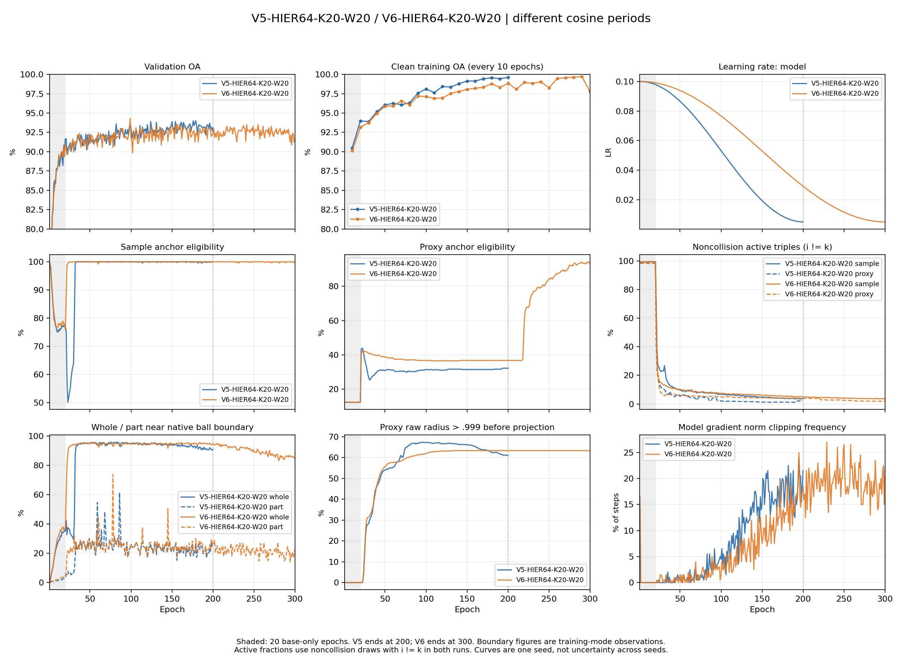

# V5-HIER64-K20-W20 / V6-HIER64-K20-W20 完整结果、代理软结构与后续建议

命名提示：本文展示名称按[统一实验命名规范](33_EXPERIMENT_NAMING_CONVENTION_2026-10-06.md)更新；原名称可查映射。文件名、运行目录、代码字段与既有结果身份保留。

日期：2026-10-04。本文是两次训练完成后的只读审计，替代运行中的快照。V6-HIER64-K20-W20 已完成 300 轮，原V6-B0-32 也已完成 300 轮。本次运行了 V6 三份权重的近四点云脚本、完整训练缓存几何分析和监测汇总，**没有启动下一轮主训练**。

## 1. 结论

1. **self-k 排除修复了一项明确的约束问题，分类效果没有随之提升。** V6 验证最优 OA 比 V5 高 0.3049 个百分点，但对应模型的最终测试 OA 低 0.8914 个百分点。它们分别只多预测对 3 个验证样本、少预测对 22 个测试样本；单种子结果不能证明方法有稳定分类收益。
2. **样本祖先的径向排序有正面证据。** V6 后 40 轮实际选中的 pair 祖先有 98.17% 比 triple 祖先更深，两种祖先都浅于对应 whole 端点。这符合两级共同祖先的预期，但尚不能证明形态语义或一棵全局一致的组合树。
3. **proxy 合格率上升没有转化成丰富的近邻软结构。** epoch300 checkpoint 的静态 proxy 图有 485 个合格代理，其中 373 个的最近四个实例是同一组 dresser。完整训练集的最近代理分配从 V5 的 49 个代理缩至 V6 的 39 个，分配有效数量也下降。
4. **类内空间总体紧凑，代理检索仍严重受少数低半径 whole 支配。** 第 300 轮类内夹角中位数 3.04°，异类 99.18°；但合格代理的近四槽位中 96.03% 来自半径最低的约 1% 样本。紧凑分类锥与丰富的形态祖先不是同一个指标。
5. 下一步优先隔离 **global64 基础协议、sample/proxy 两项的作用、以及半径对关系选择的影响**。当前数据不支持继续延长训练、增大 K 或 P 就能解决问题。

## 2. 训练身份与比较条件

| 项目 | V5-HIER64-K20-W20 | V6-HIER64-K20-W20 |
|---|---|---|
| 生产代码提交 | `6e13ff9f59ad3bec8f7c3db857e6558e37473c03` | `b3542cb7372f25758a44d2fa7bd048829947c924` |
| 初始化 | seed22 从头随机初始化 | 同一初始模型身份，从头训练，未接续 V5 |
| 数据 | 8856 train / 984 val；最终官方 test 2468 | 相同 ID、标签及 split hash |
| batch | 两卡 global64，32 类×2，类别均匀、类内有放回 | 相同 |
| HyCoRe | part 视图复写、两次普通 BN、原 FPS/CE/intra | 相同 |
| HIER | c1、D256、K20、T50、P512、margin/tau .1 | 相同 |
| 额外截断/反向 hook | 关闭，保留 shadow 和数值投影 | 相同 |
| HIER 权重 | 前 20 轮 0，随后 .5 | 相同 |
| 模型 / 代理 LR | .1→.005 / .01→.0005 | 相同端点 |
| cosine 周期、预算 | 200 轮×200 步 | 300 轮×200 步 |
| sample、proxy 的索引 self-k | 保留 | 排除 |
| 模型选择 | 最优 val OA，平局较低 val CE；test 最后一次 | 相同 |

共同模型初始化 SHA256：`fd7251e0eb6b397ecaf3862e9cc00a6bc2be9b684329fdc31dc05915b388d29d`。
共同 split SHA256：`3bbf0c79b3cb9581caeafe3f7f12caa6861f236f0159512a5998d5e9bcf25105`。

### 2.1 三类变化必须分开

- **正确性修复：** 排除索引 i=k；V6 参数审计对输入 clone，防止额外诊断的 part 复写改变该步随后真实训练的输入。
- **训练协议变化：** 总更新数 40000→60000，cosine 周期 200→300。第 200 轮实际模型 LR 为 .00500586 / .0291821，相差约 5.83 倍。V6 的前 200 轮也已处于不同学习率轨迹，不能说只是多跑了后 100 轮。
- **inter 目标：** 原三个距离 hinge、独立 hard Gumbel 选择、同代理碰撞 mask、sample+proxy 联合形式保持。没有把 proxy 绑定类别或连到 part。

参数审计输入修复只涉及 V5 的 5 个审计首 batch、V6 的 7 个审计首 batch。V5 生产调用已经保存/恢复 RNG，审计也恢复 BN；不能误写成 V5 在这些检查中始终没有恢复 RNG/BN。真实训练的 part 复写仍然保留。

## 3. 分类与训练过程

OA 是总体正确率，AA 是各类正确率的等权均值。CE 使用原 HyCoRe 的 eps=.2 标签平滑，数值不应和普通无平滑 CE 直接比较。

| 指标 | V5-HIER64-K20-W20 | V6-HIER64-K20-W20 |
|---|---:|---:|
| 最优 val OA / epoch | 94.0041% / 179 | 94.3089% / 99 |
| 同一最优 checkpoint 的 val AA | 90.7432% | 92.1992% |
| 验证选中模型的 test OA | **92.1394%** | **91.2480%** |
| 对应 test AA | 89.1581% | 88.9169% |
| 对应 test CE | 2.99697 | 2.99547 |
| 第 200 轮 val OA | 93.0894% | 92.3780% |
| 第 200 轮 clean train OA | 99.6161% | 98.8482% |
| 最后一轮 val OA | 93.0894% | 91.5650% |
| 最后一轮 clean train OA | 99.6161% | 97.7642% |
| 总耗时 | 6 小时 39 分 25 秒 | 10 小时 28 分 49 秒 |

V6-HIER64-K20-W20 于 10 月 4 日 12:01:52 完成，时区 Asia/Shanghai。其每轮平均总耗时约 125.76 秒，V5 约 119.83 秒；预算增加 50%，总耗时增加约 57.4%。这些包含评估、保存及监测。

### 3.1 后期拟合与验证差距没有消失

同为 161–200 轮：V5 平均 val OA 93.2419%，V6 92.5076%；clean train 每 10 轮测一次，同步测点的 train−val 平均差距分别约 6.30 / 6.40 个百分点。

分别看各自末 40 轮：V6 val OA 均值 92.3984%，跨轮标准差 .5242 个百分点；clean train 的 4 个测点均值 99.1701%，同步差距约 6.82 个百分点。第 300 轮 clean train 有回落，因此不能描述成训练准确率单调升高。整体仍表现为训练集拟合远好于验证集，不能仅凭这一差距把原因归给 HIER；缺少同协议 global64 零 HIER 对照。

V6 的最佳验证模型出现在 99 轮，后 201 轮没有刷新最佳验证 OA。按验证选模已经避免用最终权重替代最佳模型，但延长到 300 轮没有提供分类增益。更早停止可节省预算，不能修复最优模型本身的泛化差距。

最终 test 没有零正确率类别。V5→V6：night_stand 86.05→70.93%（86 例，少对 13 例），tv_stand 90→84%（100 例）；dresser 76.74→88.37%（86 例，多对 10 例），vase 76→87%（100 例）。小类 cup、flower_pot 只有 20 个 test 样本，5 个百分点仅是一例。此表用于描述结果，不用 test 逐类调参。

图中 active 比例统一限制为 i≠k 且 pair/triple 代理不碰撞的抽取；训练模式半径不可与后文 clean eval 缓存直接混合。曲线是单种子跨轮变化，标准差不是跨种子置信区间。可复核派生数据见 [epoch_curves.csv](artifacts/v5_v6_2026-10-04/epoch_curves.csv)。

### 3.2 原V6-B0-32 辅助基线

V6-B0-32 完成 300×307=92100 步，使用原全部 9840 训练实例、源码默认随机打乱/drop_last、workers8、seed22 和 300 轮 cosine。10 月 4 日 09:53:24 完成，耗时约 8 小时 20 分 23 秒。

源码逐轮 test 最优为 **93.841%@216，AA 90.812%**，日志精度为三位小数。ORIG-B0-32-S4780 最优 94.044%；V5-B0-32-CAP200 则为固定验证划分、200×200 步、验证选模后 test 92.5851%。完整原协议结果明显好于缩减的 V5-B0-32-CAP200，但数据、步数、学习率轨迹和选模方式都不同。它证明原路径仍能正常运行，不能单独测出 HIER 的净影响。

10 月 4 日补查全部 300 份 V6-B0-32 逐轮记录：每轮均 307 步、9824 次无放回训练抽取，有限性检查均通过。测试第 200 轮 OA/AA 为 92.950/89.788%，第 300 轮为 **93.233/90.420%**；第 300 轮训练模式 OA 为 99.125%。后 40 轮 test OA 均值 93.0865%，跨轮总体标准差 .3280 个百分点，范围 92.504–93.760%。后期有波动，没有明显崩溃；最好 OA 仍在第 216 轮。单独最高 AA 是 91.196%@256，该轮 OA93.193%，不能与第 216 轮 OA 拼成同一 checkpoint 的结果。

### 3.3 V6-HIER64-K20-W20 与 V6-B0-32 都使用官方 test，评估与选模时机不同

两者官方 test 都是同一套 2468 个实例，eval 模式、无增强前 1024 点。V6-B0-32 原源码每轮测试本轮模型，按 test OA 保存最佳；V6-HIER64-K20-W20 每轮评估 984 个验证实例，训练结束后加载验证最佳 epoch99 的模型，对官方 test 完整评估一次。V6-HIER64-K20-W20 的 `final_test.json` 明确为 `test_count=2468`、`test_smoke_partial=false`，OA91.247974%、AA88.916862%；不是漏测，也不是 epoch300 的 test 结果。

这是项目验证选模约定与本次“原源码默认 V6-B0-32 复现”要求并存的结果，启动前已记录在 [04](04_NEXT_EXPERIMENT_PLAN.md) 和 [21](21_V6_TRAINING_START_2026-10-04.md)。逐轮 test 不参与反向传播，但用于挑最好轮次时，它承担了模型选择功能。因此 best-test@216 与 best-val@99 的 test 结果不是相同选模口径，不能将 93.841−91.248 直接解释成 HIER 导致的性能损失。

本地 09:47 进度快照中的 V6-HIER64-K20-W20 `final_test=null` 是当时仅完成 240 轮的运行状态；最终已完成测试。V6-B0-32 每轮测试刚更新的模型，没有每轮加载冻结的历史 best。若要补固定轮次比较，应事先固定如 epoch200/300 的两组权重、使用相同评估函数，并将结果标为补充诊断；不能把 V6-HIER64-K20-W20 事后最高 test 轮次替换为当前验证选模主结果。训练数据、batch、抽样和更新次数差异仍需另行控制。

## 4. 覆盖率、损失与数值监测

下表“各自末 40 轮”指 V5 的 161–200、V6 的 261–300；是阶段描述，不是相同优化轨迹的因果对照。比率由抽取次数合并；每轮 coverage 取跨轮均值。

| 指标 | V5-HIER64-K20-W20 末 40 轮 | V6-HIER64-K20-W20 末 40 轮 |
|---|---:|---:|
| 单轮唯一训练 ID 覆盖 | 66.10% | 65.98% |
| sample anchor 合格率 | 99.9258% | 99.9201% |
| proxy anchor 合格率 | 31.6471% | 91.7651% |
| sample 不同 k、非碰撞 draw 的 active 比例 | 3.9127% | 3.7416% |
| proxy 不同 k、非碰撞 draw 的 active 比例 | 1.4131% | 1.9776% |
| sample 同代理碰撞 / 全部 draw | .2987% | .1369% |
| proxy 同代理碰撞 / 全部 draw | .3215% | .2041% |
| whole 接近原数值边界（r≥.99599） | 92.1076% | 86.4178% |
| part 接近原数值边界 | 21.9951% | 20.2895% |
| proxy expmap 后、安全投影前 r>.999 | 62.6950% | 63.2730% |
| 模型全局 L2 梯度范数阈值 1 的裁剪触发步比例 | 17.5375% | 18.6875% |

两次完整训练的损失/梯度监测都有限，proxy 双卡最大差异为 0。全程模型裁剪触发比例为 7.595 / 9.895%；最大裁剪前全局 L2 范数 31.446 / 45.949，裁剪后不超过 1。proxy 单独优化，不混入模型的全局 L2 范数阈值 1 裁剪。

### 4.1 哪些问题确实改善了

- V6 两图 self-k 抽取及其损失/梯度为 0。V5 后 40 轮 sample self-k 只占 2.0985% draw，却贡献 37.2008% sample loss。i=k 时同一端点的两个 hinge 要求相反的距离差再加正 margin，非碰撞时不能同时为零；排除它有明确理由。
- sample 碰撞下降；whole 边界比例有所下降；训练没有 NaN/Inf 或双卡 proxy 不一致。
- V6 增加了实际祖先使用/深度、径向角向更新和双增强稳定性监测，能区分“图里合格”与“实际被选作祖先”。

### 4.2 哪些不能算改善

- 不能直接把 V5 sample 总 active 5.80% 与 V6 3.74% 相减当成约束改善。V5 包含 self-k，统一到不同 k 后是 3.91→3.74%。同为 161–200，V6 不同 k active 反而是 5.36%。
- 两次采样计划相同，单轮 coverage 均约 66%；累计到第 21 轮都已覆盖全部 8856 ID。不是一些实例始终未训练，而是每轮类别均匀、有放回仍造成大类低覆盖和重复。
- 训练抽到的 j 约 93.6% 为跨类。global32类×2保住类别覆盖，但细粒度类内正关系占比较低；不能把高 anchor 合格率解释为已充分学习类内形态。
- 高 proxy 合格率只表示互惠正候选够用，不表示距离合理、被 sample 使用、分工丰富或形态可信。

实际共享 encoder 的 HIER/base 参数梯度范数比（已含 lambda=.5）在 V6 七个首 batch 检查中约为 .172、.220、.165、.375、.109、1.512、.202。第 240 轮有一次较大值，其余不是持续压倒基础任务；梯度夹角有正有负。不能凭一个快照断言 HIER 始终主导，或据此把降损失权重作为确定解法。

## 5. 祖先监测：有层次排序，但代理图问题仍在

c=1 下，欧氏球半径 r 与到原点的双曲深度是两种单位：

\[
d_0(x)=2\operatorname{atanh}\|x\|.
\]

定义端点差为“最浅端点深度−祖先深度”；正值表示祖先浅于全部端点。pair−triple 正值表示 pair 更深。以下合并 V6 后 40 轮实际 hard Gumbel 的非碰撞 draw，不是可视化最近代理或确定性 argmin。

### 5.1 sample 项

| 指标 | 结果 |
|---|---:|
| pair / triple 平均深度 | 1.995 / 1.691 |
| pair 比 triple 深 | 98.1686% |
| pair / triple 浅于全部对应 whole 端点 | 均 100% |
| pair+triple 联合实际使用代理 | 188 / 512 |
| pair 使用熵对应有效数量 | 58.33 |
| triple 使用熵对应有效数量 | 131.25 |

有效数量是 exp(−Σp log p)，均匀使用 n 个时等于 n；它不是“合格数量”。这些统计支持样本祖先的两级径向组织。V5 没有记录实际祖先 ID，不能声称这些数值相对 V5 提升了多少。

### 5.2 proxy 项

| 指标 | 严格浅于全部端点 | 比最浅端点更深 | 精确等深 |
|---|---:|---:|---:|
| pair 祖先 | 10.1840% | 55.5766% | 34.2394% |
| triple 祖先 | 61.1534% | 38.4175% | .4291% |

proxy pair 比 triple 深的比例为 81.0194%。pair 累计使用 497 个代理，有效数量 440.31；triple 累计使用全部 512 个，但有效数量只有 **31.41**，粗层祖先使用明显集中。

不能把 pair 的其余 89.82% 都说成反向，其中约三分之一精确等深。零按原 FP32 精确符号计数，没有追加容差。等深既可能来自同一代理身份，也可能来自投影后的相同半径。本次监测未保存端点身份重合率，不能反推该比例。

原三个 hinge 约束的是到 pair/triple 代理的距离次序，没有直接施加上述原点深度条件；proxy 图允许端点本身成为祖先候选。此现象不自动证明代码没有复现原损失，但需要检查 proxy 项能否组织所期望的更高层祖先。

### 5.3 稳定性与代理移动

第 300 轮同一首 batch 两份增强的 eval 检查：最近代理保持率 93.75%，最近四代理 Jaccard 97.08%，sample 互惠图 Jaccard 77.37%；确定性 minimax 的 pair/triple 祖先保持率为 **74.36 / 36.39%**。粗层祖先比最近代理身份更不稳定。

这里没有重放训练 hard Gumbel；不同审计轮次也不是同一固定 batch，不能把跨轮数值视为严格趋势。检查使用 whole1024 eval 两增强，真实训练还包含随机点数和 part 复写。

V6 末 40 轮 proxy 实际更新的径向/角向分量范数均值约 .00964 / .04984；平均有符号径向分量约 −2.69e−5，实际 raw 半径变化均值约 −2.22e−7。大量代理停在边界是一个状态，不能说它们后期一直快速向外跑；角向更新仍在发生。

## 6. V6 最近四点云：三份权重分别检查

沿用 V5 规则：全部 8856 个训练 ID、无增强 whole1024、eval、原 256 维 c1 距离。按该权重 proxy 的 K20 互惠资格，以 seed22 随机选十个，展示最近四个不同 ID。展示 top4 与训练 K20 分开；没有按类别纯度或好看的形状挑代理。

特征缓存、proxy 映射和源式 K20 资格使用 FP32；最近四、sample→proxy 分配、代理角距与类内统计转为 NumPy FP64。第 6.4 节的关系敏感性检查另用 FP32；它们不是同一种精度或同一次选择。

| 权重 | SHA256 | 用途 |
|---|---|---|
| V5-HIER64-K20-W20 epoch200 | `7702f5df0fb04e5bf722b97653bad81b2bae57ba8ef9273956071ecd72de858f` | 既有比较缓存 |
| V6-HIER64-K20-W20 最优 epoch99 | `b33858435e41e3f87c06eff9f68454e3ede9250eac9747a080b411ecb7fb3d06` | 验证选中，与最终 test 对应 |
| V6-HIER64-K20-W20 epoch200 | `3ed067b09505b0d0d9e1ba65eb5894c631f8a2ede0bc644dc601947851a3a41e` | 相同完成轮次，学习率轨迹仍不同 |
| V6-HIER64-K20-W20 epoch300 | `078ca9f789b13dd18e2e83e1e35e453a90eafa90fa21cea16f4f6100d383f6e5` | 最终结构，不能代替最优模型 |

> 权重 hash 以各输出 summary 的完整值为准。所有模型与 proxy 来自同一完整 checkpoint，不混搭最优模型和最终 proxy；无 test 数据参与缓存或代理选择。

### 6.1 完整合格集合的比较

“集合”忽略四个近邻的次序；“低半径 1%”为每份缓存中半径最低的 89 个样本，占 8856 的约 1.005%。

| 指标 | V5-HIER64-K20-W20 e200 | V6-HIER64-K20-W20 best99 | V6-HIER64-K20-W20 e200 | V6-HIER64-K20-W20 e300 |
|---|---:|---:|---:|---:|
| 合格代理 | 165 | 188 | 188 | 485 |
| 合格代理近四的不同 ID | 20 | 30 | 39 | 28 |
| 不同无序近四集合 | 14 | 32 | 42 | 25 |
| 近四覆盖类别 | 8 | 13 | 15 | 9 |
| 最大同集合重复次数 | 57 | 94 | 56 | **373** |
| 低半径 1% 的近四槽位比例 | 87.58% | 99.87% | 96.28% | 96.03% |
| 仅方向诊断检索的不同 ID | 91 | 328 | 173 | 190 |
| sample→最近 proxy 占用数量 | 49 | 49 | 41 | 39 |
| sample→proxy 分配有效数量 | 25.43 | 22.56 | 20.98 | **15.59** |
| 单代理最大分配比例 | 13.82% | 13.34% | 13.39% | 18.72% |

sample→proxy 是 8856 个样本各在全部 512 个代理中找一个最近者；上方 proxy→sample 是每个代理找四个样本，两者都不同于训练对三元组的 Gumbel 祖先选择。不能把这三种使用统计混为一谈。

V6 第 200 轮的检索集合比 V5 更多，但到 300 轮又明显集中。全部 512 代理的近四在四份缓存中仅覆盖 22 / 31 / 41 / 28 个 ID。V6 e300 最大四元组在全体代理中重复 **397** 次，合格集合中重复 373 次。

e300 的 485 个合格代理中，297 个 r≥.99899；之前三份权重的合格集合没有这类边界代理。实际该轮 sample pair/triple 仍只使用 188 个代理。因此高合格率包含大量边界代理，不能作为软结构质量提高的证据。

### 6.2 形态与代理位置的解释

- **e300 展示：** 十行中七行共享同一组四个 dresser，呈现矩形柜体的粗共性，但高窄、低宽等比例仍不同；另一行也是柜体变体。剩余两行是同一组“三株植物+一只花瓶”，整体形态共同性较弱。40 个展示槽位实际只有 10 个不同 ID、3 个集合。
- **best99 展示：** 五行共享“两台 monitor+chair+vase”，看不到一致的整体形态；另有 monitor/chair/dresser 混合、低平台家具局部共性。40 槽位只有 12 个 ID、5 个集合。全部十个代理该轮都实际参与 sample 祖先选择，但参与训练不等于有可信形态语义。
- e300 图中的 proxy133/44/328，其 sample pair/triple 选择次数为 0/0，proxy 项则分别选中 6551/49、8673/64、3509/34 次。不能称其完全未使用。

同一近四集合不要求代理处于同一个位置。e300 合格代理中，同集合 pair 的方向夹角中位数 13.80°，双曲距离中位数却为 10.023；异集合分别为 82.63°、8.745。边界能把很小的角差放大成很大距离；所有不同代理 pair 都没有出现 ≤1e−6 的双曲重合。

对原检索而言，双曲距离同时含半径和方向：

\[
\cosh d_1(p,x)=1+
\frac{2(r_p^2+r_x^2-2r_pr_x\cos\theta)}{(1-r_p^2)(1-r_x^2)}.
\]

少数更靠中心的 whole 可以成为许多方向不同代理的最近者。原始检索和“仅方向”的覆盖差异支持半径偏置这一解释；它不是在证明方向检索具有更好的真实形态结构，也不等于全部祖先选择失效。

### 6.3 类内紧凑程度

类内统计全部 1,552,308 个不同实例的无序同类 pair；异类每类固定 seed22 有放回抽 10000 pair，共 400000。异类以 anchor 类等权，foreign 样本按其实际数量抽；二者不是相同类权重。四模型使用相同 ID 配对。距离/夹角中位数为池化统计，R 为 40 类等权平均。

| 指标 | V5-HIER64-K20-W20 e200 | V6-HIER64-K20-W20 best99 | V6-HIER64-K20-W20 e200 | V6-HIER64-K20-W20 e300 |
|---|---:|---:|---:|---:|
| 排除自身的双曲最近邻同类率 | 99.514% | 96.206% | 98.577% | 99.718% |
| 类内 / 异类夹角中位数 | 3.74° / 97.02° | 7.60° / 98.12° | 5.31° / 98.76° | 3.04° / 99.18° |
| 类内 / 异类双曲距离中位数 | 3.098 / 9.233 | 6.808 / 11.582 | 4.675 / 9.986 | 2.319 / 8.494 |
| clean whole 半径中位数 | .98519 | .99600 | .99057 | .98042 |
| 类方向集中度 R 平均 | .992914 | .967782 | .982900 | .989261 |

R=||类内单位方向均值||，接近 1 表示方向集中。e300 典型实例 pair 比 V5 更紧，但并非每类更紧：piano 的 R=.8833、类内角度 P90=59.07°；dresser 类内角度中位数 18.76°。因此宏平均 R 仍略低于 V5。best99 的训练类内表示更松，flower_pot 最近邻同类率仅 57.46%；最优验证性能并不要求训练类锥最窄。

完整派生表见 [geometry_comparison.csv](artifacts/v5_v6_2026-10-04/geometry_comparison.csv)。这些只描述训练 split 的 clean embedding，不是泛化近邻准确率或独立形态真值。

### 6.4 补充：sample 互惠关系是否受半径影响

为避免把 proxy 检索偏置直接推成 sample 图偏置，另用四份冻结缓存做相同的 64 个 global64 计划。K20、自身参与 topK、同类+1、至少两个非self互惠正候选保持；本次诊断四模型统一排除 self-k，V5 真实训练仍保留它。只在诊断副本把 whole 半径统一到 .98，方向不变。

| 模型 | 原图与等半径图 Jaccard | 其中跨类边 Jaccard | 原图→等半径图 anchor 合格率 |
|---|---:|---:|---:|
| V5-HIER64-K20-W20 e200 | 51.91% | 49.02% | 82.18→100% |
| V6-HIER64-K20-W20 best99 | 85.83% | 84.93% | 99.85→100% |
| V6-HIER64-K20-W20 e200 | 52.86% | 49.98% | 84.79→100% |
| V6-HIER64-K20-W20 e300 | 57.78% | 55.23% | 87.72→99.95% |

Jaccard 为 64 图的交集总数/并集总数。计划有 4096 个位置、13 个批内额外重复 ID 槽位（.3174%）。NumPy FP32、同分稳定按位置选择，非 CUDA 逐位重现。此处没有抽取实际训练三元组，也没有改变任何训练。

这是后期 sample 关系对半径明显敏感的直接证据；best99 相对不敏感。clean eval 的原图合格率与训练模式约 99.9% 不同，不能互相替代。等半径只是一项控制诊断，不能据此宣称应恢复旧 v2 的等半径训练目标。

## 7. 原 HIER 几何与本结合方案的差异

核对本地原版 `HIER-CVPR23` 源码：`hier/models/model.py:111–124,141–153`、`hier/losses.py:17–35,85–104,222–245`、`hier/hyptorch/nn.py:204–216`、`hier/train.py:143–155`。

- 正常模型为 body→可选 LayerNorm→Linear→ToPoincare，**没有把全部样本半径固定为同一个值**。单位范数归一化 F.normalize 只属于 skip_head/非双曲分支，不能推广到正常双曲主分支；可选 LayerNorm 是另一种操作。
- 同一 z 送给 PA 和 HIER。PA 在损失内部归一化 z 与另一套类别代理，使用 cosine；HIER 对未归一化 z 和无类别祖先代理使用双曲距离。PA 的直接类别约束主要作用于方向。我们的原 CE/intra 与它的数学梯度不同；这不直接证明 CE 与 HIER 冲突，也不要求现在替换 CE。
- 原版默认 c=.1，对样本及代理都启用切空间范数上限 2.3 和黎曼梯度 hook。V5/V6 c=1，whole 用 HyCoRe 自己的映射，额外上限/hook 关闭；代理只有 expmap 后 .999 安全投影。

切空间上限 2.3 对应原点距离上限约 4.6；c1 的 r=.999 对应深度约 7.6004。margin/tau 数字同为 .1，不等于有效距离尺度与原版一致。

不能直接给 HyCoRe whole 加 2.3 cap：原 intra 的

\[
R_{hier}=\operatorname{mean}[d_0(part)-d_0(whole)+1000/N_{part}]_+
\]

在 Npart=200 时要求 whole 比 part 深至少 5，若 whole 最大深度 4.6 就无法满足，即使 part 在原点也不行。原点深度与训练约束的兼容性必须先验证。

同样，直接启用 hook 的因子 `(1-r²)²/4` 在 proxy r=.999 时约 1e−6、whole r=.996 时约 1.6e−5，会显著改变 inter 梯度尺度。它是度量修正，不是模型全局 L2 范数阈值 1 裁剪的替代；从当前边界状态直接开启可能让更新极弱。

## 8. 下一步优化优先级（候选，待审阅）

### A. 先补同协议 global64 V6-B64，分离基础训练协议的影响

只去掉 HIER，保持 V6 初始化、8856/984、global64、每轮 200 步、300 轮 cosine、原 CE/intra、part 复写/两次 BN、验证选模。可按两卡顺序运行，不要求四卡同时比较。应保持数据/增强随机流，必要时消费同样的独立关系随机流。

这项回答：泛化差距主要来自 balanced64 基础协议，还是加 HIER 后才出现。原 V6-B0-32 的恢复表现说明这个对照有价值；不能用普通 V6-B0-32 梯度累积声称等价于 global64 的跨样本 intra 和 BN。

### B. 冻结 whole，短测 sample 与 proxy 正则各自如何移动代理

先用现有 V6 e200 缓存及同一个代理 checkpoint 副本，固定相同 batch/关系抽取与随机流，分别检查 `Rsample`、`Rproxy`、两项合用。先测不更新的分项梯度，再做几百个仅代理更新；这些不修改 backbone，也不改变 CE/intra/part。

观察：边界代理径向梯度是否因 .999 投影消失；两项对同一代理的角向梯度是否相反；proxy endpoint 本身被选为祖先的比例；严格深度/等深/反向比例；sample pair/triple 使用分工和真实形态一致性。不能只优化合格率或低 loss。

若确证 proxy 几何导致退化，再以新随机代理、相同 whole 特征短测**只作用于代理**的源式 cap/hook 或平滑有界径向参数化。需要记录距离分位数、梯度尺度及容量变化。它属于 c1 下的适配方案，不称为原 HIER 完整复现；不应未经检验给 whole 加 cap 或强制所有祖先浅度。

### C. 将关系的半径敏感性与独立形态信号结合验证

保持 c1、CE/intra、part 和最终 loss 使用原 whole，先只读比较原距离挖关系与半径控制的关系副本。对相同 pair/triple，用归一化点云形状距离、形状描述子或盲评检验；最近四点云应包含训练实际使用的 pair/triple 祖先，并同时展示角向与原距离近邻。

可以让同学负责这一项：固定样本对和展示清单、跨增强重复、盲评是否形态相似，比较代理祖先是否稳定；源 HIER 的图像复现也使用同样的“实际使用＋半径偏置＋近四重复”指标。不能用同类别或好看的几组代替形态验证。

只有独立验证支持关系副本更可靠时，才短测“仅改变 mining，loss 仍在原 whole 上”的适配。它不会引入 proxy–part 约束；仍需量共享 backbone 的实际梯度冲突，不能保证只换选择就没有干扰。

### 暂不优先的项目

- 再加 epoch：最佳验证已在 99 轮，300 轮检索分配更集中。
- 再增 K/T/P：sample anchor 已约 99.9%；P512 的实际分工和径向状态需要先理解，代理数量不能按类别数线性放缩来解决当前退化。
- 直接降低 lambda 或 proxy LR：尚无持续梯度主导证据，proxy 后期也非持续向外移动。可作为后续单变量消融，不作为已有证据支持的根因修复。
- 立即更换 CE、新增 PA 或独立 inter head：均为更大的方法变动。共享 backbone 下另接 head 仍会干扰骨干；当前优先完成上述隔离诊断，再决定是否需要这些适配。

## 9. 本次产物与检查

代码分支 `codex/v6-results-audit`。新增/适配工具为 `visualize_v6_proxy_neighbors.py`、共享 V5 可视化、`analyze_proxy_feature_geometry.py`、`plot_v5_v6_monitoring.py`；没有改生产训练目标或原 HyCoRe。

- V6 epoch99/200/300 三份可视化均完整处理 8856 实例，严格读取配套模型/代理与 split，输出离线旋转 HTML、PNG、邻居表、缓存和身份 summary。随机十代理未做人工筛选。
- V5/V6 可视化服务器 14 项测试通过；NumPy 几何 6 项测试通过。四份缓存 ID/标签完全一致，全部代理近四重新计算均与缓存匹配。e300、best99 点云图与汇总曲线已目视检查。
- 原日志、权重、点云缓存、完整监测及主机身份保存在忽略目录和服务器新输出目录。Git 只保存工具、本文和已审查的派生图表/汇总表。
- 曲线复现入口：`python inter_hierarchy_MN40/plot_v5_v6_monitoring.py --csv docs/research/artifacts/v5_v6_2026-10-04/epoch_curves.csv --output-dir <new-output-dir>`。需要 Matplotlib，输出目录必须为新目录。

主实验下一步仍需用户审阅。本文没有把任何候选自动加入运行队列。
