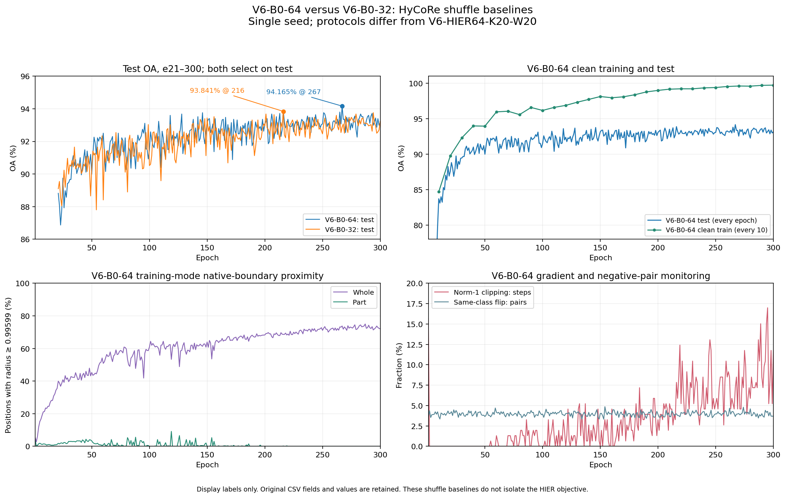

# V6-B0-64 基线：配置、启动与完成记录

命名提示：本文展示名称按[统一实验命名规范](33_EXPERIMENT_NAMING_CONVENTION_2026-10-06.md)更新；原名称可查映射。文件名、运行目录、代码字段与既有结果身份保留。

**当前状态：completed，300/300轮，2026-10-05 09:24:55 Asia/Shanghai结束。** 最佳test OA94.1653%@267，同checkpoint AA91.7116%；第300轮OA93.1524%、AA90.7872%。全程核对与比较见文末“完成结果”，下面启动验收保留为历史记录。

## 授权和问题

2026-10-05，用户批准补一个双卡 V6-B0-64 基础训练，要求使用 HyCoRe 的打乱、无放回、丢弃尾部方式，并监测基础训练指标。用户随后明确选择全部 9840 训练样本、原版逐轮官方 test 和 best-test 选模，训练 300 轮。

本实验检验原采样方式下双卡 V6-B0-64 的基础训练是否稳定，帮助理解 V6-HIER64-K20-W20 与原 V6-B0-32 之间的差异。它同时改变了 V6-HIER64-K20-W20 的抽样、数据量和每轮步数，因此不是严格的 HIER 单变量消融。

## 固定设置

| 项目 | 配置 |
|---|---|
| 入口 | `inter_hierarchy_MN40.hycore_b64_v6.train` |
| 初始化 | seed22，从头随机，不读取历史权重/teacher |
| 空间、主干 | c=1，D256，原 Hype_pointMLP |
| 数据 | 全 9840 train、官方 2468 test，没有 validation |
| 批量 | 两卡 local32，global64 |
| 采样 | 每轮一个完整全局排列，153 个完整 batch；9792 个唯一实例，丢尾 48，无补齐、无放回、无重复 |
| 预算 | 300 轮×153 步＝45900 次更新 |
| 输入 | whole800–1024、part200–600，part 视图复写 whole；首层 FPS 请求512 |
| 基础损失 | 原标签平滑 CE eps=.2，`.01Rcontr+.01Rhier`，margin4及`1000/Npart` |
| 负配对 | global child.flip(0)，自然同类负配对不筛掉 |
| HIER | 无 HIER loss、无 proxy、无 proxy optimizer |
| BN | 每卡32的普通训练BN，child/whole各更新一次；DDP广播rank0 buffer |
| 优化 | RiemannianSGD，LR.1，momentum.9，WD2e−4；300轮cosine至.005 |
| 梯度裁剪 | 模型全局 L2 范数阈值1，不因V6-B0-64改变LR |
| test/选模 | 每轮test；按原三位小数OA严格更高保存best，平局不换 |
| eval 分块 | 16，以保持与V6-B0-32一致 |
| workers | 4/rank，总8 |
| 保存 | 每轮last/best/metrics/heartbeat，每20轮存档；optimizer/scheduler与两rank RNG/sampler/BN |

## 算子兼容与限制

全局64的连续位置分给 rank0 前32和 rank1 后32，汇总两卡的嵌入和logits后计算全局 CE/intra。使用已有的可微 all-gather：反向 SUM 与 DDP 参数梯度平均抵消，不额外乘除 world size。全局 flip 会把负 part 配到另一张卡；不能改成各卡 local flip。

旧 balanced 入口强制 flip 异类，不能直接用于普通 shuffle。新路径允许源式随机 batch 的同类负配对并监测其比例。intra 的零点使用原 `torch.max` 算子，与 ReLU 在精确零点的梯度区别明确保留。

普通 local32 BN 和单卡 batch64 BN 不等价；rank0 buffer 广播也不是 SyncBN。各 rank 的 running mean/var 可不同，梯度与模型参数应同步，BN计数每步均增加2。采样排列和双卡随机流可重现，但不声称与原单卡 DataLoader 的 PyTorch 随机流逐位一致。

原脚本直接使用train batch64时，test分块默认会是32。本次显式使用16，与既有原V6-B0-32保持相同评估分块；完整test数量和源式选模规则不变。

## 监测与验收

- CE、Rcontr、Rhier、加权总损失，训练模式OA/AA和逐类结果。
- 每步实际global64的类别数、flip同类negative比例；实际采样ID与全局计划顺序一致。
- 每轮唯一实例与逐类覆盖、重复次数、丢尾；生产断言153步、9792不同ID。
- whole/part半径与原点深度、球边界附近比例及关闭额外截断的shadow统计。
- 原part复写、两次BN更新、FPS请求、固定c1；非有限值失败记录。
- 裁剪前后范数/触发比例、两rank梯度和参数一致性、实际LR/耗时/显存。
- 每轮官方test OA/AA、逐类准确率及CE；保存source-rounded与raw值。源码CE按batch等权，另存样本加权CE，避免混合口径。
- 每10轮额外全量clean train评估，观察train/test差距；eval及诊断恢复RNG和训练状态。

启动前：采样CPU测试、源损失与分布式基础梯度检查、双卡2轮×2步短测；短测只测有限test batch并明确标smoke，不能使用其权重初始化生产。正式训练须确认第1轮全153步、完整2468test、checkpoint和第2轮推进后才报告挂起成功。

## 启动阶段验收（历史）

分支：`codex/v6-b64-shuffle-baseline`。生产提交：`56b40a2b11d3274ff7a9832b8e4cced3b366ec5c`。已按本地提交/推送、服务器干净工作区fetch及pull --ff-only更新。

验收记录：

- 8项采样CPU检查、2项新入口与原源码损失/梯度检查、6项已有分布式/输入算子CPU检查通过。损失值逐值一致，独立FP32梯度图最大约3e−11累加差异，梯度测试容差rtol1e−6/atol1e−10；精确零点hinge半梯度另作严格检查。
- 独立短测目录完成2轮×2步、共4次更新。每轮实际128个唯一训练ID；每轮只看32例test，均明确标记smoke/partial，不用于报告分类结果或初始化生产。
- 短测两rank梯度差、更新后参数差均为0；裁剪后范数最大0.99999988，单卡峰值allocated显存28444.64MiB。四步同类flip负数分别0/0/6/2，全部合法且正常通过。
- BN每步+2、输入alias复写和固定c1断言通过，test/cleantrain评估buffer不变；last/best保存和checksum通过。重新CPU加载checkpoint，确认248模型状态项、126优化器状态项、调度器及两rank RNG/sampler/BN均存在；未宣称断点恢复已测试。
- 正式任务使用全新结果目录，2026-10-05 00:48:45Asia/Shanghai在两张完全空闲GPU启动，已脱离当前连接运行。生产从头随机seed22，不读取短测权重。服务器路径、PID、GPU编号/UUID仅保存在忽略的本地私有记录和服务器manifest/launcher_state，不提交仓库。

正式挂起验收已通过：

- 第1轮完成153次更新，实际draws/唯一ID均9792，覆盖99.5122%，重复0、补齐0、丢尾48。实际完整test2468例、155个eval batch，buffer保持不变。
- 第1轮last/best和metrics均保存，last约160.03MB；首末步两rank梯度差/参数差均0。153步损失/梯度保持有限，裁剪前范数最高6.3041、24步触发原norm1裁剪（15.69%），裁剪后最大0.99999982；同类flip负配对比例3.6560%。峰值allocated显存28445.89MiB。
- 第1轮训练及test/保存统计耗时104.65秒（不含前置初始化）。首次test OA19.7326%只是启动轮监测，不是训练最终结果。
- 启动验收时heartbeat已到第3轮第4步，manifest保持running，官方全量test已执行，训练进程已脱离当前连接独立运行。此为当时快照；全300轮已完成，最终核对如下。

## 完成结果与全程核对 — 2026-10-05

生产manifest从00:49:47.630至09:24:55.429 Asia/Shanghai，总墙钟30907.798秒，即8小时35分08秒；启动派发时间00:48:45包含前置启动，不能与训练计时混用。完成300轮，无记录的运行错误。检查未重新跑GPU推理，读取已有完整test/clean-train监测，并重算实际best/last文件SHA256。

| 指标 | best epoch267 | final epoch300 |
|---|---:|---:|
| 官方test OA，未四舍五入 | **94.165316%**（2324/2468） | **93.152350%** |
| 同checkpoint test AA | **91.711628%** | **90.787209%** |
| 标签平滑test CE，样本加权 | 2.997836 | 3.001554 |
| 无增强全9840 clean-train OA | 此轮没有测点 | 99.735772% |
| 无增强全9840 clean-train AA | 此轮没有测点 | 99.644388% |
| flower_pot test正确率 | 15%（3/20） | 15%（3/20） |

best仍按源式三位小数OA严格更高选取，未用AA或CE重选。epoch300训练模式OA99.3158%，clean-train与同轮test OA差6.5834个百分点；clean flower_pot为139/149，即93.2886%。没有test零准确率类别，但flower_pot的明显泛化差距值得单独看。小类20个test实例，一例就改变5个百分点。

### 300轮监测是否完整

- **样本：** 每轮153步、9792个不同ID、48个丢尾、0重复/0补齐，覆盖99.5122%；累计epoch2见过全部9840。每轮40类均覆盖，batch类别数均值27.7815，范围18–36；任一类别任一轮最低唯一覆盖93.75%。
- **评估：** 300次完整2468test、每次155个batch；30次完整9840 clean-train。记录的eval buffer均保持不变；OA/AA与逐类count重算一致。
- **有限性与同步：** 所有逐轮loss/gradient有限检查通过。每轮首末步各检查一次，两rank参数与梯度的600个检测点最大差均为0；不是对45900步逐步比较所有参数。
- **裁剪：** 原norm1共触发1469/45900步，即3.2004%；末40轮8.2843%。全程裁剪前最大L2范数15.7439，裁剪后最大0.999999940。
- **保存：** 300份逐轮metrics、15份每20轮档案，以及best/last齐全。best267 SHA256为`3ba1322a7cf1e0a9516fffaf77b331395220f66acaa834f2b1a88fe681d05f09`；last300为`a479eee7bc3e0c1532c5beddd716844e12f1d26d8ed8a86bd861f37556e9428a`，实际文件重算匹配保存记录。
- **几何：** 末40轮训练模式whole/part靠近原数值球边界的比例72.8375%/.002298%；whole/part平均shadow cap比例98.6198%/.2770%。shadow是最终嵌入logmap超过2.3的反事实统计，没有实际额外cap/hook。final whole/part平均双曲深度6.1012/3.0301；末40轮未加权Rhier/Rcontr为.136009/.467729。

### 与V6-B0-32、V6-HIER64-K20-W20怎样比较

| 指标 | V6-B0-64 | V6-B0-32 |
|---|---:|---:|
| best-test OA / epoch | 94.1653% / 267 | 93.841% / 216 |
| final300 test OA | 93.1524% | 93.233% |
| 末40轮test OA均值 | 93.2466% | 93.0865% |
| 末40轮跨轮标准差 | .3576个百分点 | .3280个百分点 |
| 训练墙钟 | 8小时35分08秒 | 8小时20分23秒 |
| 优化器更新数 | 45900 | 92100 |

V6-B0-64墙钟仅多约14分45秒，增幅2.95%；两卡GPU占用总时约17.17 GPU小时，原V6-B0-32约8.34，不能将墙钟相近理解为资源成本相同。best OA约高.324个百分点，相当于约8个test实例；final约低.081个百分点。单种子、随机流/BN/更新数不同，不能宣布V6-B0-64必然带来准确率提升。

当前基础训练可正常达到94%左右，但仍有train/test差距和类别弱点。**没有HIER的V6-B0-64也有大量whole贴边**，因此whole饱和不能单独归因于inter。V6-HIER64-K20-W20使用8856/984划分、balanced有放回、200step以及val选模；V6-B0-64使用全9840、shuffle153step及test选模，仍不是同协议HIER消融。

分类对比面板展示epoch21–300；[派生CSV](artifacts/b64_v6_2026-10-05/epoch_curves.csv)保留1–300。clean-train每10轮才有测点；几何来自训练模式采样位置。曲线仅反映单次训练，跨轮标准差不是多种子置信区间。

交接详见[25技术路径](25_HYCORE_HIER_HPCS_TECHNICAL_HANDOFF_2026-10-05.md)与[本地私有24工程文档](/D:/Hycore/.codex-local/handoff/24_PROJECT_ENGINEERING_HANDOFF_2026-10-05.md)。本次只做读取、核对和文档工作，不修改权重、旧结果或训练代码，不启动新实验。
