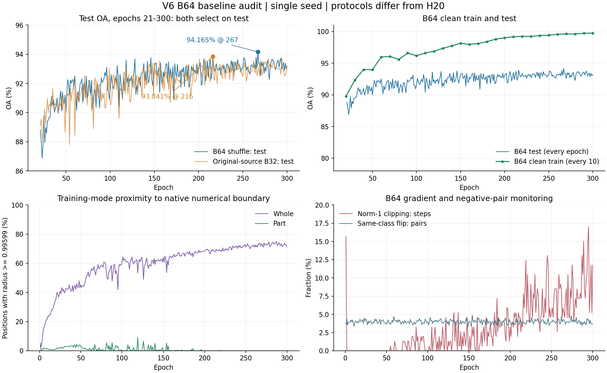

# 技术交接：HyCoRe + inter 的思想、论文依据与当前困难

日期：2026-10-05，Asia/Shanghai。面向新接手同学。本文件可独立介绍方法与证据；服务器、权重位置、运行命令及配置身份见同日的 [本地私有工程交接](/D:/Hycore/.codex-local/handoff/24_PROJECT_ENGINEERING_HANDOFF_2026-10-05.md)，该文件不进入共享仓库。完整 V5/V6 结构统计见 [22](22_V5_V6_RESULTS_AND_STRUCTURE_2026-10-04.md)，B64 的配置与验收见 [23](23_V6_B64_SHUFFLE_START_2026-10-05.md)。

## 1. 先理解我们想解决什么

我们的任务是 ModelNet40 的点云整体分类。原 HyCoRe 已经让一个物体的 whole 表示和随机局部 part 表示共同在双曲空间训练；我们希望在此基础上增加 **不同 whole 实例之间的软层次关系**，使相似形态的实例拥有较近、较具体的共同祖先，更远的实例拥有较粗的共同祖先。

当前路线是 **共享 whole 表示 + HIER 抽象祖先代理**：

1. 保留 HyCoRe 的整体分类 CE、part–whole intra、主干和输入流程。
2. 将同一个 whole 嵌入交给 HIER，学习 whole–proxy 和 proxy–proxy 关系。
3. proxy 是可学习的抽象祖先，不绑定类别，也不要求它等于某个真实 part 的嵌入。
4. part 仍由共享网络和原 intra 约束训练；目前不增加 proxy–part 损失。

这是用户当前认可的实验设想。用户的直觉是：HIER 改变 whole 的位置后，part 可通过共享参数和 intra 随之适应，从而兼顾组合先验、分类和实例亲缘。它有明确的梯度路径，但“随之适应”不是一个已被证明的几何跟随定理；需要检查 part–whole 深度差、距离关系及实际共享参数梯度。

如果两个形态接近的同类实例具有祖先 \(p_{ij}\)，更远的同类或跨类实例具有更粗祖先 \(p_{ijk}\)，希望 \(p_{ij}\) 成为后者的后代。**可以探索一棵统一组合树的可能性**，现阶段不以预先限定论文主张来排除实验。但两种正则共用空间、部分局部祖先次序满足，尚不能证明所有实例和 part 已组成同一棵全局一致树。

### 1.1 不要把历史路线当成当前实现

| 路线 | 关系来源及目标 | 是否当前主路线 |
|---|---|---|
| legacy / 最初 HypHC | 类内三元组、旧特征相似度缓存、Gromov 积软排序；曾有广播和 ID 顺序错误 | 历史代码，保留复现 |
| v2：冻结 teacher + 等半径 + 精确几何 LCA | teacher 的类内距离排名；student 构造同方向、同半径的叶子副本，以降低半径对亲缘排名的干扰 | 历史对照，非 V5/V6 训练 |
| V3/V4：共享 whole + HIER proxy | 引入在线 sample/proxy 祖先目标；早期分开 in/out、修改算子/BN/采样等造成多重混杂 | 中间版本，不能当原 HyCoRe 基线 |
| V5/V6 H20 | 原 HyCoRe 操作恢复；同一个 whole 上一个 inter＝sample + proxy；全局64训练 | 当前被验证的结合路线 |
| V6 原 B32 / 新 B64 shuffle | 不含 HIER，用于确认基础训练能否恢复、batch 与协议是否稳定 | 基础训练基线 |

冻结 HyCoRe teacher 是 **自蒸馏**。即使它提供稳定的相似度，也不能据此声称找到了独立的真实形态层次。等半径可以作为诊断控制；当前并未把 whole 的训练半径统一，也未恢复旧 teacher 路线。

## 2. 三篇论文分别提供什么

| 论文 | 被组织的实体 | 有标签主任务 | 层次机制 | 对本项目的价值与边界 |
|---|---|---|---|---|
| **HyCoRe**：Montanaro、Valsesia、Magli，NeurIPS 2022 | 整体物体与随机局部子点云 | 物体分类 CE | part 比 whole 浅；本实例 part 相对更靠近 whole | 提供现有分类训练和 part–whole 先验；未直接训练跨实例的可学习祖先代理 |
| **HIER**：Kim、Jeong、Kwak，CVPR 2023 | 图像实例及无类别层次代理 | PA、MS 等度量学习损失 | 在线互惠邻居三元组 + 可学习 pair/triple 祖先 + 三个距离 hinge | 提供 whole 实例之间的抽象软层次；图像协议、空间尺度和监督形式不能原样套入 HyCoRe |
| **Onghena / HPCS**：Onghena、Gigli、Velasco-Forero，ICCV Workshops 2023，SHARP | 点云内的点级特征；最终解码每个物体的分割树 | flat part labels 下的 CosFace / LMCL；源码还有其它分支 | 学习相似度 + HypHC 连续层次聚类 + 旋转不变特征 | 说明点云特征与层次目标可联合学习；不是整体实例分类，也不是 HIER 的自由祖先代理方法 |

原文与官方仓库：

- HyCoRe：[NeurIPS 论文页](https://proceedings.neurips.cc/paper_files/paper/2022/hash/da8f9fc2b555d122369f36a9684415c1-Abstract-Conference.html)，[官方代码](https://github.com/diegovalsesia/HyCoRe)。
- HIER：[CVPR 论文页](https://openaccess.thecvf.com/content/CVPR2023/html/Kim_HIER_Metric_Learning_Beyond_Class_Labels_via_Hierarchical_Regularization_CVPR_2023_paper.html)，[作者 arXiv 正文](https://arxiv.org/html/2212.14258v3)，[官方代码](https://github.com/sung-yeon-kim/HIER-CVPR23)。
- Onghena 的准确题目是 **Rotation-Invariant Hierarchical Segmentation on Poincare Ball for 3D Point Cloud**，不是泛称“点云分类层次论文”。[ICCVW 论文页](https://openaccess.thecvf.com/content/ICCV2023W/SHARP/html/Onghena_Rotation-Invariant_Hierarchical_Segmentation_on_Poincare_Ball_for_3D_Point_Cloud_ICCVW_2023_paper.html)，[官方 HPCS 代码](https://github.com/TheCrossProduct/HPCS)。
- HPCS 的聚类目标来自 Chami 等人的 HypHC：[From Trees to Continuous Embeddings and Back: Hyperbolic Hierarchical Clustering，NeurIPS 2020](https://proceedings.neurips.cc/paper/2020/hash/ac10ec1ace51b2d973cd87973a98d3ab-Abstract.html)。不应把 HypHC 与 HIER 的 proxy hinge 当成同一种损失。

本文主要核对已保存的论文正文和本地官方源文件，线上核对论文与仓库身份。HIER 源码固定版本为 `3986a744a1a54fd357e307d1cb3f2e81910b9ffc`；HPCS 本地副本没有在本交接中确定其上游 commit，不把它声称为已锁定版本的复现。后续同学复现 HPCS 时应补记上游 commit。

## 3. HyCoRe：当前必须保留的基础机制

### 3.1 空间、表示与单位

记 whole 为 \(\mu_i\)，part 为 \(\nu_i\)，曲率为 \(-c\)，其中 \(c>0\)。球是

\[
\mathbb B_c^D=\{x:c\|x\|^2<1\},\qquad
d_c(0,x)=\frac{2}{\sqrt c}\operatorname{atanh}(\sqrt c\|x\|).
\]

V5/V6 固定 \(c=1,D=256\)。\(\|x\|\) 是球内欧氏半径，\(d_1(0,x)=2\operatorname{atanh}\|x\|\) 是到原点的双曲距离，本文称“深度”。二者不是同一个数值单位。例如 \(r=.999\) 的深度约 7.6004。

源码结构是 PointMLP 的欧氏聚合特征 → `proj`（512维）→ `expmap0` → Möbius embedding（256维）得到 \(\mu\)，再由 Möbius classifier 输出40维分类 logits。part 调用同一套主干与 embedding；CE 只用 whole 分类输出。

源码定位：[PointMLP HyCoRe 模型](../../classification_ModelNet40/models/pointmlp.py)、[原损失与 part 采样](../../classification_ModelNet40/hutil.py)、[原训练入口](../../classification_ModelNet40/main_pointmlp_hycore.py)。

### 3.2 分类 CE

当前保持源码的标签平滑：40类中真类目标为 \(.8\)，其余每类为 \(.2/39\)。

\[
L_{CE}=-\frac1B\sum_i\sum_{a=1}^{40}q_{ia}\log\operatorname{softmax}(\ell_i)_a.
\]

用户希望由 CE 承担 HIER 中“可靠的有标签主目标”的角色。这个设想成立于训练结构层面：CE 提供类别监督，HIER 补充自举关系。**CE 与 PA 不同不等于存在必然冲突，也不能保证没有冲突**。CE、intra、HIER 共享 \(\mu\) 与主干，其协同应看实际参数梯度及泛化结果；目前没有根据要求替换 CE 或新增 PA 代理。

### 3.3 intra 的表达式

每个实例、每个训练 step 采一个随机 part；不是说物体只有一个语义部件。后续 step 会换中心、点数与增强。

\[
R_{contr}=\frac1B\sum_i
 [d_1(\mu_i,\nu_i)-d_1(\mu_i,\nu_{B-1-i})+4]_+,
\]

\[
R_{hier}=\frac1B\sum_i
 [d_1(0,\nu_i)-d_1(0,\mu_i)+1000/N_{part}]_+,
\]

\[
L_{base}=L_{CE}+.01R_{contr}+.01R_{hier}.
\]

\(R_{hier}\) 直接规定 part 比 whole 浅多少；小 part 要求更大间隔。\(R_{contr}\) 用正负测地距离帮助实例/类别分开。可以把它们理解为主要从深度和亲缘两方面配合，但 \(R_{contr}\) 的完整双曲距离同时含半径和方向，**它不是严格的纯角度损失**。两个式子也不强制每个 part 与 whole 共线。

原论文式(6)把负 part 描述为来自异类物体；原发布代码只是 `pos_child_mu.flip(0)`，配合随机 shuffle，并不检查类别。新 B64 保留这个源码行为，记录同类负配对比例；H20 的全局类别块布局使 flip 配到另一类。这是论文语义、源码实现及本项目协议之间应分别披露的差异。

原源码通过 `torch.max(value, zero)` 实现 hinge。V5/V6 H20 使用同公式的 ReLU；新 B64 保留源码 `torch.max`。在一般非零位置相同，精确零点的梯度约定不同；不能隐去这一细节，也没有证据将分类差距归因于该稀有边界。

### 3.4 part 复写、BN 和 FPS 为什么不能随意改

- whole800–1024点、part200–600点，均通过随机中心的空间 kNN 采样。
- 原 `pos_child = data[:, :, :k]` 是视图，随后赋值会改共享存储。第二次 part 采样复写 whole 的前部，whole forward 所见点集因此改变，可能出现重复点。不是把 part embedding 直接拷进 whole embedding。
- 点的数组位置本身不是语义；点云网络力求顺序不变。但重复点会改变采样密度、可用集合和局部运算，故这一行为可能影响 CE 和 HIER。我们保留它以恢复源码训练，尚未把它证明为有意设计的数据增强。
- 每 step 先 part forward，再 whole forward，普通 BN 更新两次。共享权重不代表两张卡共享同一批 BN 统计。local32 的普通 BN、SyncBN 和单卡64 BN 是不同训练协议。
- 首层 FPS 固定请求512中心。part 少于512点时可能重复索引；当前保留原请求。FPS 是选点中心的网络操作，与上面的输入视图复写是两个操作。

V4 曾同时改 part 存储、BN 更新及 batch，基线明显失常。恢复后 V5、原 B32 和新 B64 均没有 V4 那样的严重推理崩溃。这个证据支持先保持源码操作；不能单独宣布 part 复写或 BN 中某一项已被证明为唯一原因。

## 4. HIER：关系、祖先和三个 hinge 到底如何工作

### 4.1 proxy 不等于类中心

HIER 中有两类容易混淆的 proxy：

- **PA proxy**：Proxy Anchor 度量学习主目标中的类别代理，绑定已知类，计算归一化特征/代理之间的 cosine。当前 HyCoRe + inter 没有新增它。
- **hierarchy proxy**：无标签的可学习祖先参数，可服务于同类亚型、跨类共性或其它代理。当前用512个，256维。一个代理不固定对应某类或固定树层。

代理训练在切空间保存参数 \(v_p\)，经指数映射为球内 \(p\)。当前初始化为

\[
v_p\sim\mathcal N(0,I_D)\cdot(2.3\times.9)/\sqrt D.
\]

这是随机方向及随机范数的高维初始化，不是“40类每类分若干代理”，也不是 k-means 的类中心。V5/V6 没有 epoch20 后特征聚类初始化；那是更早版本的设置。

### 4.2 当前 sample 关系挖掘

对同一 global64 batch 的 whole，源码式 sample 相似度是

\[
S_{ij}=\exp[-d_1(\mu_i,\mu_j)]+\mathbf1[y_i=y_j].
\]

距离用于当前 embedding，选关系时 `detach`，不通过离散 topK 的排序本身反传。损失中的 whole–proxy 距离有梯度。

令 \(N_K(i)\) 为相似度最高的 K 个位置，**K包含自身位置**。互惠集合为

\[
R_K(i)=\{j\ne i:j\in N_K(i),\ i\in N_K(j)\}.
\]

一个 anchor 至少有两个非自身互惠正候选，即 \(|R_K(i)|\ge2\)，且负池非空。否则跳过它。当前 V6：

\[
j\sim \mathrm{Uniform}(R_K(i)),\qquad
k\sim \mathrm{Uniform}(\{0,\ldots,B-1\}\setminus(R_K(i)\cup\{i\})),
\]

每个合格 i 独立、有放回抽50组 j/k。抽样50次可重复同一对关系，不意味着增加50个输入实例；覆盖率应同时报告不同三元组、不同数据 ID 和角色覆盖。

关键解释：

- j 是互惠近邻，不是由“同类”定义的固定 positive；k 是互惠集合补集，不是由“异类”定义的固定 negative。
- 只有单向近邻也会进入负池；不能写成“所有 topK 外样本才是 negative”。
- 同类 +1 优先帮助同类位置进 topK，但 K20 有足够空位容纳跨类关系。它不是用 cosine +1，也不是只在同类内部挖三元组。
- H20 全局32类×2，一个 i 只有一个其它同类位置。满足两个非self互惠候选通常必然包含至少一个跨类 j 候选；它体现软结构要超出类标签，也说明在每类两例时，训练不会以大量细粒度类内三元组为主。后期实测约93.6%的被抽 j 是跨类。
- 集合定义一般允许同类 k，但在当前每类两位置、K20、同类+1且正常距离数值条件下，另一个同类位置会优先进入双方topK，属于互惠正池；V6的非self k通常是异类。V5同类k主要来自源码self-k。每类实例更多、K较小或关系规则不同才可能让其它同类位置落入负池；不能把“一般允许”误说成当前配置频繁发生。

代理图使用 \(S_{pq}=\exp[-d_1(p,q)]\)，没有标签加分；其它 K20、资格和抽样规则相同。

源码定位：[V5/V6 共用关系实现](../../inter_hierarchy_MN40/hier_proxy_scratch_v5/relations.py)。原固定源码：[HIER losses.py](https://github.com/sung-yeon-kim/HIER-CVPR23/blob/3986a744a1a54fd357e307d1cb3f2e81910b9ffc/hier/losses.py)。

### 4.3 pair / triple 祖先如何选

设一组三元组 \((x_i,x_j,x_k)\)，候选祖先是全部 hierarchy proxies。每个代理的 pair/triple 代价为

\[
a_p=\max(d(x_i,p),d(x_j,p)),\qquad
b_p=\max(a_p,d(x_k,p)).
\]

对 \(-a_p/\tau\)、\(-b_p/\tau\) **独立**执行 hard Gumbel-softmax，得到 \(p_{ij}\)、\(p_{ijk}\)，当前 \(\tau=.1\)。正向各选一个代理，反向用 soft 部分的 straight-through 梯度。它不是单纯确定性最近代理，也不是直接计算两端点测地线的最近原点位置。

为每个三元组计算

\[
h_i=[d(x_i,p_{ij})-d(x_i,p_{ijk})+m]_+,
\]
\[
h_j=[d(x_j,p_{ij})-d(x_j,p_{ijk})+m]_+,
\]
\[
h_k=[d(x_k,p_{ijk})-d(x_k,p_{ij})+m]_+,
\]

\[
R(X,P)=\frac1{|\mathcal T|}\sum_{t\in\mathcal T}
\mathbf1[p_{ij}\ne p_{ijk}](h_i+h_j+h_k),\qquad m=.1.
\]

对 i/j，pair 祖先应更近；对 k，triple 祖先应更近。同代理碰撞的 draw 置零，但仍计入均值分母。**没有额外直接要求祖先深度、指定树边或固定层数。**层次深度组织是这种距离关系可能诱导的结果，必须监测，不能从变量名 LCA 推断已成立。

当前一个 inter 是

\[
R_{inter}=R(\{\mu_i\},P)+R(P,P).
\]

第一项 endpoint 是 whole；第二项 endpoint 也是 proxy，祖先候选仍是同一 proxy 集合。因此 proxy 自身可能被选作祖先端点，不自动构成严格有向树。当前不再分独立 in/out 损失；两项分别取均值后相加，也不是按 sample/proxy 抽取条数做一个总池加权平均。

实现：[V6 hier_loss.py](../../inter_hierarchy_MN40/hier_proxy_scratch_v6/hier_loss.py)。

### 4.4 论文、发布源码、当前实现的差异

| 内容 | HIER 论文叙述 | 发布源码 / 当前适配 |
|---|---|---|
| 三元组标签 | 论文3.2.1说按互惠邻居、不考虑类标签 | 源码 sample 图同类相似度 +1；当前保留 |
| 祖先碰撞 | 论文描述 triple 祖先在排除 pair 祖先的集合中取 | 源码独立 Gumbel 两次、碰撞后置零；当前保留 |
| self-k | 关系描述不强调退化 i=k | 源码对角填−1，因此进入负池；V5保留，V6明确排除两图索引self-k |
| 无合格 anchor | 论文不给完整异常处理 | 源码直接 concatenate 空列表可能失败；当前空图返回零损失并监测 |
| 样本几何 | 常规图像网络映射到球，不固定所有样本半径 | 当前直接用原 HyCoRe whole；未给whole加等半径副本 |
| 主目标 | 归一化嵌入上的 PA/MS 等 | 当前原 Möbius CE + intra，是方法适配 |

i=k 不是同代理碰撞。若 i=k 且 pair/triple 祖先不同，\(h_i\) 和 \(h_k\) 对同一端点要求相反的距离差加正 margin，不能同时为零。V5 后40轮 self-k 仅占2.10% draw，却贡献37.20% sample loss；V6排除有明确正确性理由。相同数据 ID 在不同采样位置仍可能重复，当前只排除索引 i=k；两者不要混称。

### 4.5 原 HIER batch 与我们的 batch

官方 ResNet50 CUB/Cars 示例用两卡，每卡 `batch_size=90, IPC=2`；每卡45类×2，全局90类×2＝180。类别在 global batch 先选再分 rank，当可用类别足够时两rank不重复选类；每类内有放回抽两位置，可以恰好抽到同一图片。类块相邻保留，`UniqueClassSampler` 没有在末尾再随机打散所有行。

这不是所有 HIER 数据集都固定90类：它是这些脚本的 batch 设置；当要求类数超过数据集可用类数，源码会对类别也有放回抽取。CUB 原训练类总数是100，90是该batch覆盖的类数，不是数据集类别总数。

常规 PA/MS 分支将两卡 z/y 可微汇总后，**同一个全局 embedding batch 同时供 ML 与 HIER**，没有给 ML 和 HIER 分别造两套实例输入。SupCon 分支有不同分组处理，不能用来概括所有入口。

官方类内有放回代码注释明确提到非均匀类别数量。它用类别均匀抽样保证批内类别广度，却不保证每个epoch遍历全部实例，也没有通过该 sampler 确保大类无遗漏。类别平衡和实例覆盖是不同目标。

当前 H20 两卡各16类×2，全局32类×2＝64；每轮200步并不自动遍历数据。V6末40轮单轮唯一实例覆盖约65.98%，累计多轮可覆盖所有8856训练ID。新 B64 则整轮shuffle，无放回，9792/9840＝99.5122%覆盖，丢48尾部。它有不同的类别构成，不是把H20的有放回抽关系简单改成全数据遍历。

源码：[HIER sampler.py](https://github.com/sung-yeon-kim/HIER-CVPR23/blob/3986a744a1a54fd357e307d1cb3f2e81910b9ffc/hier/sampler.py)、[CUB 示例](https://github.com/sung-yeon-kim/HIER-CVPR23/blob/3986a744a1a54fd357e307d1cb3f2e81910b9ffc/scripts/Resnet50/hier_CUB.sh)。

## 5. c=1 适配是当前最重要的几何差距之一

原 HIER 常用 \(c=.1\)，在样本和代理映射前截切空间范数到2.3，并在映射输出处用 inverse-metric 反向处理：

\[
\nabla_x^{\rm corrected}L=
\frac{(1-c\|x\|^2)^2}{4}\nabla_x^{\rm Euclidean}L.
\]

V5/V6 固定 c1，**不启用这个额外 hook 和2.3切空间cap**；保留影子统计及数值球投影。HyCoRe 的原映射/投影不删除，proxy 映射后使用 .999 安全球半径上限。关闭额外cap不等于数值无边界保护。

必须区分三件事：

1. **切空间 cap**限制映射前的特征范数，是几何容量/深度限制。
2. **inverse-metric hook**按位置调整反向梯度；在边界附近会大幅缩小梯度。
3. **梯度裁剪**在反传后限制参数梯度大小。当前只对模型全局L2范数阈值1裁剪；proxy 单独 AdamW，不混入该norm。原 HIER `clip_grad>0` 触发的是梯度元素截到 \([-10,10]\)，不是同一种范数裁剪。

\(d_c(0,\exp_0^c(v))=2\|v\|\)，因而2.3切空间cap对应最大深度4.6。原 intra 在 part200点时要求 whole 比 part深5；若直接给whole深度设上限4.6，即使part在原点也无法满足。**不能未经兼容性分析把原 HIER cap 直接打开。**

相同数值 margin/tau=.1，换 c 和映射范数后，距离分布、Gumbel logits及梯度尺度并不等效。当前保留数值是已审阅的实验选择，不是已经消除了曲率影响。c1 proxy r=.999 时 hook因子约1e−6；whole r=.996时约1.6e−5，直接开启也可能使 inter 更新极弱。

当前 proxy 参数初始化方向、随机范数和 HIER 源式尺度保留，但没有在后续把切空间范数限制住。大量代理被 expmap 后安全投影，可能损失径向可调性；应测真实切空间梯度和投影状态，不能仅凭外观说代理一直快速向外跑。

官方定位：[ToPoincare](https://github.com/sung-yeon-kim/HIER-CVPR23/blob/3986a744a1a54fd357e307d1cb3f2e81910b9ffc/hier/hyptorch/nn.py)、[反向和距离函数](https://github.com/sung-yeon-kim/HIER-CVPR23/blob/3986a744a1a54fd357e307d1cb3f2e81910b9ffc/hier/hyptorch/pmath.py)。

### 5.1 学习率与损失权重不要混称

当前 H20 的联合目标为

\[
L=L_{CE}+.01R_{contr}+.01R_{hier}
 +\lambda_H(e)\{R_{sample}+R_{proxy}\},
\]

前20轮 \(\lambda_H=0\)，第21轮起固定 .5。模型RiemannianSGD的 LR .1→.005；proxy AdamW的 LR .01→.0005；\(\lambda_H=.5\) 是损失权重，不是LR。两个优化器按整个300epoch的cosine变化，proxy前20轮不step，启用时调度不重启。用已完成epoch数 \(e\) 表示共同因子：

\[
s(e)=.05+.95\frac{1+\cos(\pi e/300)}2,\qquad
lr_{model}=.1s(e),\quad lr_{proxy}=.01s(e).
\]

模型与proxy分别优化及同步，模型裁剪不包含proxy。学习率调度是结合HyCoRe的适配；例如原HIER CUB脚本是每5轮减半，并非当前cosine。

HIER 官方参数组给 hierarchy proxies **50倍 backbone LR**，PA类别proxies **10⁴倍**；这是 `get_params_groups` 源码设置。它们面对预训练图像主干的低LR，不能因此给HyCoRe .1的模型直接配5.0代理LR。官方脚本的HIER权重常为 .5，parser默认为1；不能说“论文权重1，所以当前必然小很多”而不核对实际实验脚本。

当需要调整时，应把目标函数权重、优化器类型/参数组、调度、几何反向四件事分开记录。降低LR也不等于给每轮loss自动降权；一项作用于整个参数更新，另一项作用于该目标的梯度。

## 6. Onghena / HPCS：可借鉴的理念与不可直接搬来的内容

### 6.1 真正的任务和联合目标

论文只要求 flat part segmentation labels 来学习点级的层次聚类，并使用VN类网络获得旋转不变特征。它不是提供物体间祖先真值，也不是无需标签。点标签同时用于CosFace/LMCL主目标以及easy-triplet挖掘。

CosFace / LMCL 在单位方向上使用已知分割类别的权重 \(A\)：

\[
L_{LMCL}=-\frac1n\sum_i\log
\frac{\exp[s(\widehat A_{y_i}^{\top}\widehat z_i-m)]}
{\exp[s(\widehat A_{y_i}^{\top}\widehat z_i-m)]
 +\sum_{a\ne y_i}\exp[s\widehat A_a^{\top}\widehat z_i]}.
\]

论文整体目标是 \(L_{LMCL}+\lambda C_{HypHC}\)。本地官方 `MetricHyperbolicLoss` 使用CosFace分支时margin=.35、scale=2；还保留triplet metric分支。PartNet另有hierarchical CosFace可选代码，不能把主论文只用flat标签的讨论扩展成所有分支都完全无层次信息。

### 6.2 HypHC 如何表达三元组层次

对点特征三元组，取三对相似度 \(w_{ij},w_{ik},w_{jk}\)，以及三对几何LCA的原点深度 \(a_{ij},a_{ik},a_{jk}\)。HPCS先将用于LCA的特征归一到可学习共同半径：

\[
\widetilde z_i=s_r\frac{z_i}{\|z_i\|},\qquad
s_r=\operatorname{clamp}(\text{scale},10^{-4},1).
\]

再令

\[
\omega_{ab}=\operatorname{softmax}_{\{ij,ik,jk\}}(a_{ab}/\tau),
\]

\[
C_{HypHC}^{\rm code}=
\operatorname{mean}_{t}\left[
w_{ij}+w_{ik}+w_{jk}-\sum_{ab}\omega_{ab}w_{ab}
\right]+\operatorname{mean}_{a,b}w_{ab}.
\]

在固定相似度下，更深的LCA得到更大softmax权重；损失希望更深的那对也是更相似的那对。它在 **三对几何LCA深度之间竞争**；HIER则从离散可学习祖先集合选择pair/triple代理，然后对端点距离做三个hinge。这是两个不同的机制。

源码中的 `hyp_lca` 通过等距变换/反射计算原点到两点所在测地线的投影；不是从自由proxy集合选一个点。源码 `normalize_embeddings()` 在LCA前统一半径，最终每个物体的 `_decode_linkage()` 使用共同半径特征的cosine complete-linkage解码树。不要把源代码解码方式称为直接输出训练得到的固定树边。

### 6.3 论文文字和官方代码中的符号、训练细节

本地官方 `CosineSimilarity.compute_mat()` 明确返回

\[
w_{ij}=(1+\cos(z_i,z_j))/2.
\]

这个相似度有梯度，未detach。论文第4节定义相似度的文字/公式则写 \((1-\cos)/2\)，存在 **相似度与距离符号不一致**；实现分析应以已核对源函数为准，论文复现需记录这一差异，不能默默当两者相同。

`+mat_sim.mean()` 单独最小化会压低平均相似度；它不是“拉升相似度”的正则。联合目标实际结果取决于CosFace、三元组权重和该项，不能只凭加号推断防塌缩效果。若把相似度矩阵看作独立变量，三元组部分对其系数为 \(1-\omega_{ab}\ge0\)，也显示单靠聚类项不能保证学到有用的相似度；有标签metric目标很关键。

默认训练开启easy-triplet miner：同标签positive、异标签negative，保留正相似度高于负相似度的easy关系。源码还允许 `miner=False`，此时枚举点pair并随机取第三点，排除i=k/j=k。不能把可选分支统一说成“永远有标签挖三元组”。

源码支持温度退火，但 `anneal_step=0` 默认不触发；启用时在指定epoch结束调用，不是每step自动乘退火系数。forward 将batch中的点特征展平后算loss，test解码则逐物体；这与我们每物体仅一条whole向量不同。

代码定位：[本地 HPCS 目标](../../资料库/HPCS/hpcs/loss/ultrametric_loss.py)、[相似度](../../资料库/HPCS/hpcs/distances/cosine.py)、[精确LCA](../../资料库/HPCS/hpcs/distances/lca.py)、[主模块及解码](../../资料库/HPCS/hpcs/models/base_hyp_hc.py)、[easy miner](../../资料库/HPCS/hpcs/miner/triplet_margin_miner.py)。对应[官方 loss 文件](https://github.com/TheCrossProduct/HPCS/blob/main/hpcs/loss/ultrametric_loss.py)、[官方 cosine 文件](https://github.com/TheCrossProduct/HPCS/blob/main/hpcs/distances/cosine.py)。

### 6.4 对本项目最有价值的借鉴

- 可靠的有标签目标与在线层次目标可以联合学；这支持尝试CE + inter，不要求先引入固定外部层次标签。
- 需要区分“生成相似关系”和“把关系嵌入为层次”两件事。关系若主要由分类锥或半径偏差决定，层次损失再成功也可能只放大这个偏差。
- 等半径LCA有助于检查方向亲缘，但HyCoRe需要径向part–whole间隔。HPCS的归一方式不能不经兼容性检查直接施加到当前whole训练。
- 独立旋转不变主干属于更大结构变化，当前不是已批准的修复；现有ModelNet40对齐物体也不能据此声称模型具有HPCS式旋转不变性。
- 从点级HypHC到实例级目标是值得探索的应用迁移；本交接不声称它是文献中的“首次”。新颖性需单独检索和定义。

### 6.5 纠正历史阅读笔记

`资料库/HyCoRe_vs_HPCS_损失函数对比.md` 是旧分析，不是实验事实。其下列说法不应用作当前论证：

1. “Gromov积=精确LCA深度”不一般成立。\((d_0(x)+d_0(y)-d(x,y))/2\) 在树度量下等于LCA深度，在双曲空间是相应近似；不能用它替代精确测地投影而宣称无差别。
2. “mat_sim.mean()拉升相似度”符号方向反了，如上所述。
3. “在线有梯度相似度避免自举循环问题”没有这种保证。在线目标可协同学习，也可共同退化；冻结teacher可以提供稳定目标，却仍是自蒸馏。两者需实验比较。
4. “首次将HypHC从intra迁移到inter”不是经过文献核查的结论。

旧笔记保留以追溯研究思路；接手同学应使用本文和真实源码，不照搬这些结论。

## 7. 当前实验究竟证明了什么

### 7.1 分类结果与协议

| 实验 | 数据/采样/预算/选模 | test OA / AA | 可以支持的结论 |
|---|---|---:|---|
| V4 B0 | 8856/984，改过part/BN/batch，200轮 | 88.3712% / 见历史报告 | 该早期基础协议异常，不能作原HyCoRe性能基线 |
| V5 H20 | 8856/984，balancedglobal64，200×200，val选模 | 92.1394% / 89.1581% | 恢复算子后严重后期崩溃缓解；没有isolated HIER增益证据 |
| V6 H20 | 同split/batch，300×200，self-k排除，val选模 | 91.2480% / 88.9169% | 修正self-k并延长训练，没有提高最终分类结果 |
| V6原源码B32 | 全9840、shuffle/drop_last，300×307，逐轮test选模 | 93.841% / 90.812%，best216 | 原基础训练能恢复到正常水平；不同协议工程基线 |
| V6新B64 shuffle | 全9840、两卡local32、global64，300×153，逐轮test选模 | **94.1653% / 91.7116%，best267** | 双卡global64原式采样的基础训练可达到正常水平 |

新B64于2026-10-05 09:24:55完成，耗时8小时35分08秒。epoch300 test OA93.1524%、AA90.7872%；clean train OA99.7358%、AA99.6444%。它不是每轮准确率不波动、没有拟合差距的模型，也不应用最后一轮替代best结果。

B64相对源码B32的best OA高约.324个百分点，约多对8个test实例，是单种子工程结果；更新次数、随机流、分布式BN等不同，不能归因于batch64必然更好。H20与两种source-style基线还有训练样本量、每轮覆盖、步数、模型选择等差别，**不能拿94.1653−91.2480宣布HIER导致该差值**。H20使用validation选模、只最终test一次；B32/B64经用户明确要求逐轮test选模，best-test有选模优势，不是同一科研评估口径。

### 7.2 B64 基础监测及其对解释的影响

300轮均完成153step、9792不同ID、drop48、完整test2468，所有loss/gradient检查有限；600个每轮首末步检查的双rank参数/梯度最大差为0。B64没有HIER或proxy，所以没有HIER合格率指标是正常情况。

| 指标 | 新B64 shuffle | 原源码B32 |
|---|---:|---:|
| 末40轮test OA均值 | 93.2466% | 93.0865% |
| 末40轮跨轮标准差 | .3576个百分点 | .3280个百分点 |
| 末40轮test OA范围 | 92.2609–94.1653% | 92.504–93.760% |
| 总墙钟耗时 | 8小时35分08秒 | 8小时20分23秒 |

B64墙钟时间约增加2.95%，不是两倍；它使用两卡，GPU占用总时仍需另外计算。末40轮四个固定clean train测点均值99.6621%，在相同epoch的train−test差平均6.7731个百分点；epoch300差6.5834个百分点。best267没有对应clean train测点，不能拼接270轮的clean train。

图的分类对比面板为epoch21–300，完整1–300派生值见[CSV](artifacts/b64_v6_2026-10-05/epoch_curves.csv)。clean-train每10轮评估；边界比例为训练模式sampled positions。此图比较基础训练的稳定性，不隔离HIER效果。

**大量whole贴边并不只出现在HIER训练。** B64末40轮训练模式whole接近原球边界的比例72.8375%，part .0023%；\(R_{hier}\) 均值.136009（乘.01后.00136009），\(R_{contr}\) .467729。epoch300平均whole/part深度6.1012/3.0301。无HIER的原intra本来就会推动whole更深，因此不能把H20的whole贴边直接归因于inter。

B64末40轮whole的shadow cap比例98.6198%，part .2770%。这里是**从最终embedding反算logmap后是否超过2.3的反事实统计**，不是实际触发过HIER cap，也不是记录HyCoRe网络真实中间特征已被截断。H20末40轮whole/part贴边比例86.42/20.29%与B64不同，但数据、采样、预算、评估协议未匹配；这值得控制诊断，不能直接宣称HIER造成两者全部差异。

后续[26的统一原HyCoRe/B64逐类诊断](26_ORIGINAL_HYCORE_B64_CLASS_GEOMETRY_2026-10-05.md)给出更具体的边界：best clean test whole贴边率在历史B32/源码B32/B64仅.0405/.1216/.0810%，训练模式比例不能直接当推理表示结论。同一权重、相同已复写whole与part400，eval gap为.767/.831/.575，train BN gap为3.005/3.117/3.060。改变local32成员、固定负实例ID，会移动双曲几何但几乎不改分类。这个原版也存在的BN依赖，要求我们单独验证HIER邻居和祖先在分组/推理模式之间是否稳定；不能只从CE正常或intra训练loss低推断统一树已形成。

### 7.3 有关系可训不等于形态层次成功

V6后40轮 sample anchor 合格率99.9201%；所有已抽取draw中，满足索引k≠i、祖先非碰撞且至少一个hinge>0的比例约3.7416%；proxy anchor合格率91.7651%。这三个比例回答不同问题：

- **合格anchor**：互惠正候选至少两个，允许抽三元组。
- **碰撞**：pair/triple选中同一代理，draw被mask。
- **active**：非碰撞后至少一个hinge>0，仍有该约束需要优化。

低active可能是关系满足、候选容易或结构退化，不单独判好坏。高proxy合格率不是代理都被sample使用，也不是代理语义良好。

V6后40轮实际sample祖先：pair平均深度1.995、triple1.691；pair比triple深98.17%，二者均比对应whole端点浅。它支持 **局部两级径向次序**，还没有证明真实形态亲缘或全局统一树。

proxy项的pair祖先严格浅于所有端点仅10.18%，55.58%比最浅端点更深，34.24%精确等深；triple浅于全部端点61.15%。等深不应全当反向，祖先是否就是endpoint也需另外记录身份。原loss没有直接深度hinge，故这种现象是目标行为需要诊断的证据，不是凭此判“没有复现HIER”。

### 7.4 top4可视化暴露的困难

训练 **K20** 是关系邻居数，展示 **top4** 是每个代理检索最近四个点云实例；没有在K4训练。Fig.5式图只能作直观证据，定量使用原高维双曲空间。

V6 epoch300全部合格代理485个，其中373个展示同一组四个dresser；合格集合top4只涉及28个不同训练ID。约96.03%的展示槽位来自8856训练实例中半径最低的约1%。sample→最近proxy占用39个，熵对应有效数量15.59；这与训练实际选作pair/triple祖先的代理统计不同。

“不同代理展示同一组实例”不等于代理位置完全重叠。该权重同集合代理的方向夹角中位13.80°、双曲距离中位10.023，没有不同代理的距离≤1e−6。靠中心的少数whole可成为许多方向代理的最近者，距离检索受半径支配。

同时，类内方向整体很紧：epoch300同类夹角中位3.04°，异类99.18°，最近邻同类率99.718%。**类锥紧凑可以与形态检索退化同时存在。**它不说明同类全部点相同，也不证明分类紧凑本身是坏事。

冻结缓存上，V6e300原sample互惠图与等半径.98图Jaccard仅57.78%，跨类55.23%。这是sample关系本身也受半径影响的直接诊断，不能仅依据proxy top4重复就推断。该诊断不是训练改动，不能自动推导出该恢复旧等半径目标。

## 8. 可行性判断：可以继续，但下一步要回答更具体的问题

**仍然可行的部分：** whole/part/proxy可处于同一c1空间，共享whole联合反传已数值稳定；原CE/intra基础训练能恢复；HIER学到了多数sample pair/triple祖先的相对深度次序；proxy不必对应真实part才能作为抽象祖先。这些支持继续研究该结合路线。

**尚未解决的部分：** 分类未显示可靠收益，当前proxy检索结构集中；sample mining的跨类关系多且半径敏感；proxy→proxy目标的深度/身份组织不足；源HIER的cap/hook关闭后，距离和更新尺度适配没有完成。当前证据不支持把问题简单归为loss权重太小、batch不足或P不够。

CE没有数学上必然与HIER冲突的证明，也没有无冲突保证。另接inter head仍回传共享主干；仅分头可以减少最后几层直接争用，但不能声称隔离了骨干梯度。是否需要分头应由诊断决定，不能先把它当成已解决冲突。

两类层次可以形成同一组合树，也可能只形成局部软关系或不一致图。要推进“统一树”主张，需要检查跨三元组祖先身份、传递次序、代理有向关系是否有环，以及part/whole抽象层级能否一致解释；不要求先人为匹配跨实例part或新增proxy–part损失才能做这些实验。

## 9. 下一步优先级与同学可以承担的任务

以下是 **建议，不是已授权的新主训练队列**。先做固定特征诊断，再让用户审阅下一组大训练。

### A. 先隔离基础协议与HIER的增量

新shuffle B64已表明global64基础训练可正常恢复。严格HIER增量仍需要 **matched对照**：same split、same sampler、same global64、same预算/BN/增强/随机流和val选模，仅令 \(\lambda_H=0\)。现有B64同时换fulltrain、shuffle、153step和test选模，未完成这个因果对照。

如考虑把HIER搬到原式shuffle B64，应先只读测试每batch的类别数、同类候选数、合格anchor/角色/ID覆盖及负flip类别；不得假设它自然满足H20所有关系要求。方案最终需要同时保留一致基础协议和关系资格，不能只为了凑足三元组改变不记录的采样因素。

### B. 冻结whole，对proxy目标做短诊断

用同一V6完整checkpoint和固定whole缓存，对 `Rsample`、`Rproxy`、两项合用分别测梯度和几百个代理更新，记录：

- 各proxy径向/角向梯度、实际更新、安全投影触发和接近边界比例。
- 两项对同一proxy的梯度夹角，有无长期拉扯或径向梯度因投影失效。
- 被选祖先是否与endpoint同ID、pair/triple深度次序、等深/反向比例、使用熵与集中度。
- 固定同一三元组下loss变化和祖先身份稳定性，而不是不断换候选比较loss。

若证据指向代理几何，可短测 **只作用于proxy** 的源式cap/hook或平滑有界径向参数化；whole先保留原HyCoRe。这样避免与intra深度要求直接矛盾。它是c1适配消融，不称完整复制原HIER几何。

### C. 建立独立形态与关系稳定性检查

这最适合交给已经复现原HIER的同学：

1. 固定图像HIER与点云H20的检查协议，锁定checkpoint、数据ID和高维距离定义。
2. 除“每代理最近4例”，还展示 **实际训练选中的pair/triple祖先及其endpoint**；两种检索都保留失败例，不按好看程度筛选。
3. 同时比较原双曲近邻与方向/等半径控制，量top4重复、唯一实例覆盖、低半径样本占比、代理使用熵。
4. 相同实例两份增强比较互惠边Jaccard、pair/triple祖先保持率；固定样本跨checkpoint比较，避免批次变化伪装趋势。
5. 为点云关系加独立信号：一致归一后的Chamfer距离、形状描述子、或盲评形态接近/共同轮廓。Chamfer只表示几何接近，不自动定义语义祖先或复杂度方向；物体对齐/采样密度会影响它。

交付物是带ID/协议/失败例的表与可旋转点云页面，外加每个判断对应的原始几何量。先回答“原HIER也有相似半径/检索集中吗”“哪些关系跨增强且符合独立形态”，再决定训练改动。

### D. 最后再做参数规模消融

当前sample合格率已约99.9%，不优先再加K/T；P512不是按90→40类线性换成256就有理论最优性。应先解释实际使用/有效数量、祖先分工和投影状态，再做P256/512同协议对照。

也不优先继续延长epoch：V6best val在99，300轮检索更集中。调proxy LR、lambda、margin或tau可以作为后续单变量消融，但应先测距离分位数、hook有效因子、实际参数梯度及祖先固定关系。

## 10. 接手时的阅读与复核清单

建议顺序：本文件 → [本地私有工程交接](/D:/Hycore/.codex-local/handoff/24_PROJECT_ENGINEERING_HANDOFF_2026-10-05.md) → [22完整结构证据](22_V5_V6_RESULTS_AND_STRUCTURE_2026-10-04.md) → [23新B64](23_V6_B64_SHUFFLE_START_2026-10-05.md) → 原三篇论文及相应loss源码。没有私有服务器访问权限的同学可跳过工程文件；本文、22/23及官方源码足以开始方法与只读分析。

| 要回答的问题 | 首先查的代码或记录 |
|---|---|
| 原HyCoRe CE/intra/输入/训练到底是什么 | `classification_ModelNet40/main_pointmlp_hycore.py`、`hutil.py`、`models/pointmlp.py` |
| H20 whole/part如何global64反传 | `hier_proxy_scratch_v5/base_protocol.py`、`distributed.py` |
| 同类+1、K含self、资格>=2、负池定义 | `hier_proxy_scratch_v5/relations.py` |
| 当前self-k排除和祖先loss | `hier_proxy_scratch_v6/hier_loss.py` |
| 当前训练配置、优化器与评估 | `hier_proxy_scratch_v6/train.py`、[21](21_V6_TRAINING_START_2026-10-04.md) |
| 真实祖先深度、使用和增强稳定性 | `hier_proxy_scratch_v6/structure_monitor.py`、[22](22_V5_V6_RESULTS_AND_STRUCTURE_2026-10-04.md) |
| B64原式采样基线 | `hycore_b64_v6/sampling.py`、`train.py`、[23](23_V6_B64_SHUFFLE_START_2026-10-05.md) |
| 每代理近四点云和几何分析 | `visualize_v6_proxy_neighbors.py`、`analyze_proxy_feature_geometry.py` |
| HPCS 的正确相似度、LCA和聚类loss | `资料库/HPCS/hpcs/distances/cosine.py`、`lca.py`、`loss/ultrametric_loss.py` |

接手者每次报告应分开 **公式/算子正确性修复、训练协议变化、inter目标本身的效果**。真实结构结论必须说明关系来源、空间与单位、所用checkpoint和数据split、分母及是否独立形态验证。不要用低loss、高anchor合格率、同类紧凑或几组漂亮可视化中的任何一项单独宣布成功。
