# HyCoRe跨实例软层次：V3—V7实验进展与热点机制

汇报日期：2026年10月10日。材料截止：2026年10月8日已完成的训练与审查。

**主线：从方法选择，走到基础协议修复，再走到数值安全与结构有效性的分离。** 当前可以确认V7解决了代理参数的数值投影饱和，分类成绩回升；尚不能确认它形成了稳定、广泛且有独立形态意义的类内软层次。样本热点是接下来需要解释和处理的问题。

本稿按**75分钟**组织，包含讲述、读图和停顿。正文可直接用于口头讲解；标为“读图”的段落用于指图，不必逐字念。60分钟时压缩早期版本和公式推导；90分钟时展开附录与导师讨论。所有图件、数值和方法假设均来自既有文献资料、实验文档与审查报告，本次没有新训练、新数据分析或新绘图。来源编号对应包内TXT原文；数学公式统一使用显示公式。

## 时间与内容安排

| 时间 | 内容 | 本节要回答的问题 |
|---|---|---|
| 0—4分钟 | 研究目标与HyCoRe基础 | 要增加的inter究竟是什么？ |
| 4—18分钟 | Onghena与HIER：为何调整路线 | 两种层次机制有什么区别，为什么优先HIER？ |
| 18—30分钟 | V3—V5：早期失败与协议恢复 | 哪些变化是在修基础训练，哪些是在改inter？ |
| 30—42分钟 | V6—V7：关键诊断、改动与主结果 | V7真正修好了什么，分类收益有多大？ |
| 42—56分钟 | V7的分层代理与样本热点 | 已激活代理在哪，为什么浅样本成为热点？ |
| 56—70分钟 | 原版HIER三数据集对照 | 原版也有热点吗，与V7有什么几何差异？ |
| 70—75分钟 | 已有假设与下一步决策 | 优先验证哪个机制，什么才算解决问题？ |

---

## 一、研究目标：在原HyCoRe的whole—part之外增加whole—whole关系（0—4分钟）

### 1.1 从已有分类模型出发

我们研究的是ModelNet40的点云整体分类。原HyCoRe同时编码整个物体whole和随机局部点云part：分类损失监督whole，intra损失让同物体part与whole保持关系，并让part位于比whole更浅的位置。它提供了“局部到整体”的组合先验。

我们想增加的inter，组织的是**不同物体实例的whole**。同类也可能有不同形态，相近实例应共享更具体的祖先，差异较大的实例应共享更粗的祖先。希望主任务仍然是分类，而软层次为实例表征补充关系；现阶段并没有物体间祖先的真值标签。

因此，分类OA提高与层次结构成立是两个需要分别检验的终点。类别方向更清楚，也不自动等于同一类别内部的形态关系更好。后面的实验演变，就是逐步把这两类证据拆开。

### 1.2 HyCoRe已有的径向需求不能随意删除

记whole为mu，part为nu。当前基础损失沿用原HyCoRe：

$$
L_{\mathrm{base}}
=L_{\mathrm{CE}}+0.01R_{\mathrm{contr}}+0.01R_{\mathrm{hier}},
$$

$$
R_{\mathrm{contr}}
=\frac1B\sum_i
\left[d(\mu_i,\nu_i)-d(\mu_i,\nu_{B-1-i})+4\right]_+,
$$

$$
R_{\mathrm{hier}}
=\frac1B\sum_i
\left[d(0,\nu_i)-d(0,\mu_i)+\frac{1000}{N_{\mathrm{part}}}\right]_+.
$$

这里第二项明确利用原点深度：part点数越少，要求它相对whole越浅。因此，whole的半径同时承担原模型的组合约束，不能为了让inter的近邻图更好看，就直接统一所有whole的训练半径。

当前融合方案保留PointMLP、原CE和intra，把**同一个whole嵌入**交给HIER；512个hierarchy proxies表示抽象祖先，不绑定40个类别，也没有新增proxy—part损失。part可通过共享参数和原intra受影响，但这不是已经证明的统一全局树。[S25](sources/S25.txt)

**过渡句：** 这个需求决定了选文献时最重要的标准：方法能否直接组织完整实例，以及能否在不破坏原分类和径向机制的前提下加入。

---

## 二、为什么阶段性放下Onghena路线，优先HIER（4—18分钟）

### 2.1 两篇文章看似都发现结构，组织的对象其实不同

| 比较项 | Onghena / HPCS | HIER | 与本项目的关系 |
|---|---|---|---|
| 文献定位 | ICCV Workshops 2023，SHARP | CVPR 2023 | HPCS应准确称workshop论文 |
| 组织对象 | 点云内的点级特征，输出物体分割树 | 完整图像实例及抽象祖先代理 | 我们的inter对象是whole实例 |
| 有标签主目标 | flat part labels下的CosFace/LMCL | PA、MS等度量学习主目标 | HIER更接近“主目标＋实例关系正则”的组织方式 |
| 层次构建 | 三对几何LCA深度竞争 | 自由代理中选择pair、triple祖先，再施加距离约束 | HIER提供可直接监察的祖先参数 |
| 径向处理 | 用于LCA的叶子特征先统一到共同半径 | 官方样本、代理映射均有切空间cap；不预设类别代理配额 | HPCS的等半径不能直接施加到原whole |
| 迁移成本 | 点级标签、点级输出、旋转不变网络与树解码 | 样本嵌入、主监督、关系挖掘、可学习代理 | HIER便于先保留HyCoRe主体 |

HIER不是纯无监督聚类文章。它的定位是“超越类别标签的度量学习”，已有有标签主损失，层次项补充类标签不能表达的关系。我们将图像度量学习主目标换成点云分类CE＋intra，仍然属于方法适配；便于插入不代表原超参数和优化流程都能原封不动迁移。[S25](sources/S25.txt)

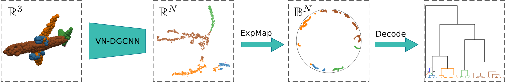

**读图：** 从左到右依次是物体点云、VN-DGCNN点级特征、指数映射、每个物体的树解码。重点指“一个点云中的很多点”与“我们的一个whole向量”的区别。图来自HPCS官方仓库，原样复用。

### 2.2 HPCS的层次不是HIER的代理层次

HPCS对一个三元组计算三对相似度，以及三对几何LCA的深度。较深的LCA通过softmax取得较大权重，目标希望更深的那一对也是更相似的那一对。用于几何LCA的特征统一半径，最后逐物体解码分割树。

$$
\widetilde z_i=s_r\frac{z_i}{\|z_i\|},
\qquad
\omega_{ab}
=\operatorname{softmax}_{ab\in\{ij,ik,jk\}}
\left(\frac{a_{ab}}{\tau}\right).
$$

这里的LCA是由两端点几何关系计算得到的，不是从一组自由可学习节点中选择的。完整源码损失包含相似度项，细节见S25；汇报时不必逐项推导。需要保留的区别是：**HPCS在三对几何LCA之间竞争，HIER在代理集合中挑选祖先。**

HPCS仍有借鉴价值：有标签目标可以与在线层次目标联合学习；“生成可靠关系”和“把关系组织成层次”是两个问题。我们暂时放下的是它作为当前直接实现路线的优先级，并非认为其理论没有价值。[S25](sources/S25.txt)

### 2.3 早期实验支持调整路线，但没有证明HIER胜过官方HPCS

HPCS/HypHC启发的早期路线，用派生A3模型作冻结teacher，提供类内距离排名；student用等半径叶子和精确LCA排序。它是自蒸馏适配，不是Onghena官方模型在ModelNet40上的完整复现，也不是后面的scratch V3。

先做的teacher信号检查发现：

| 关系来源 | 每轮可靠三元组 | 起始或首轮满足率 | 当时的解释 |
|---|---:|---:|---|
| cosine teacher | 229 | 88.65% | 类内动态范围和可优化空间有限 |
| 双曲距离teacher | 约17,050 | 59.11% | 覆盖与优化空间较充分，进入主对照 |

20轮同协议比较中，inter方法与零inter控制的最佳OA仅相差0.0405个百分点，末轮相差0.0810个百分点。结构检查如下：

| 固定无增强结构检查 | Spearman | 三元组满足率 | 排序损失 |
|---|---:|---:|---:|
| A3起点，参考也由A3产生 | 0.8050 | 72.238% | 0.03974 |
| 零inter控制末轮 | 0.4576 | 59.535% | 0.05951 |
| 加inter末轮 | 0.4708 | 60.320% | 0.05257 |

方法弱缓解了相对A3的漂移，但两臂都低于起点；teacher和评估参考又来自同一个A3。这个结果更接近“维持已有关系”，不能证明发现了独立的形态层次。

因此，当时转向HIER的理由是：**需要减少对冻结teacher的依赖，显式学习可监察的实例祖先，同时保留可靠的分类主目标。** 我们没有两种官方方法的同协议完整胜负实验，不能说“Onghena被实验证明失败，HIER被证明成功”。[S01](sources/S01.txt)、[S25](sources/S25.txt)

### 2.4 HIER到底怎样选择和训练祖先

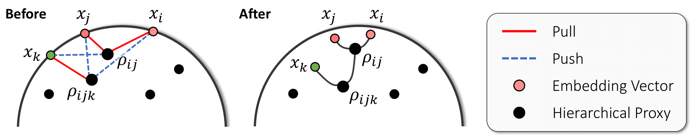

**读图：** 粉色i/j应更靠近pair祖先，绿色k应更靠近triple祖先。右侧树形是目标示意，不能将这张文献示意当成我们实际已学出树的证据。

HIER先在当前batch中挖互惠近邻。当前适配中的sample相似度为：

$$
S_{ij}=\exp[-d(\mu_i,\mu_j)]+\mathbf1[y_i=y_j].
$$

取topK并检查双方互惠。一个anchor至少有两个非self正候选；从互惠池抽j，从补集抽k。V6开始显式排除索引k=i。代理图做同样的挖掘，但没有类别加分。

对每组三元组，用所有512个代理作为候选，计算：

$$
a_p=\max\{d(x_i,p),d(x_j,p)\},
\qquad
b_p=\max\{a_p,d(x_k,p)\}.
$$

在负代价上独立执行hard Gumbel-softmax，分别得到pair祖先和triple祖先。前向选一个代理，反向保留soft选择的straight-through梯度。随后施加三个hinge：

$$
h_i=[d(x_i,p_{ij})-d(x_i,p_{ijk})+m]_+,
$$

$$
h_j=[d(x_j,p_{ij})-d(x_j,p_{ijk})+m]_+,
$$

$$
h_k=[d(x_k,p_{ijk})-d(x_k,p_{ij})+m]_+,
\qquad m=0.1.
$$

同代理碰撞置零，但仍计入分母。当前inter包括两个分项：

$$
R_{\mathrm{inter}}=R(\{\mu_i\},P)+R(P,P),
$$

$$
L=L_{\mathrm{base}}+\lambda_H R_{\mathrm{inter}}.
$$

第一项的端点是whole，第二项的端点也是proxy；第二项的祖先候选仍是同一组proxy。官方代码确实包含代理—代理项。它直接更新代理，不直接依赖编码器whole，但可通过后续代理位置影响sample项。

三个hinge没有直接指定代理的原点深度，没有给代理分配固定层数，也没有要求代理必须进入某一个类簇。软层次是否形成，需要从实际角色、几何关系与独立形态证据中检查。[S25](sources/S25.txt)、[S46](sources/S46.txt)

**过渡句：** 选HIER之后，早期困难首先来自移植协议。下面按“发现了什么问题、为什么改、改后解决了什么”回顾，而不是只按版本排列参数。

---

## 三、V3—V5：先把基础训练恢复，再解释inter（18—30分钟）

### 3.1 名称先统一，避免把不同基线混在一起

| 名称 | batch组织 | HIER是否启用 |
|---|---|---|
| B0-32 / B0-64 | HyCoRe式实例shuffle，无放回、drop_last | 关闭 |
| B32 / B64 | HIER式class-balanced | 关闭 |
| HIER32 / HIER64 | 同相应balanced基线 | 启用 |

32/64都表示global batch。双卡各local32对应global64。K20是训练近邻参数，NN4是检索展示数量；旧H20的20指K20，不代表warmup20。

V4的4类×8、特殊队列和BN1协议用LEGACY限定。现代16类×2的B32/HIER32没有已完成主训练，不能将旧V4或shuffle32重新标成它们。[S33](sources/S33.txt)

### 3.2 V3：有了在线代理，但分类推理严重退化（约2分钟）

V3从随机初始化开始，共享20轮HyCoRe前缀，然后分为类内sample＋proxy臂，以及再加类间sample的臂。batch为4类×8，307步/轮；128代理由e20特征聚类初始化，之后经过倍率ramp。没有同协议无HIER控制。

| V3历史快照，不是e300最终验收 | 类内臂 | 类内＋类间臂 |
|---|---:|---:|
| 规范名 | LEGACY-V3-HIER32-IN-SCALE3 | LEGACY-V3-HIER32-INOUT-SCALE3 |
| 已有日志最高test OA | 85.29%，e131 | 87.48%，e146 |
| 最新记录轮次 | e260 | e262 |
| 该轮train OA | 92.70% | 93.71% |
| 该轮test OA | 50.45% | 69.53% |

这些是09号交接中的运行快照；没有在现有文档中验收最终300轮，也没有按峰值保存对应best权重。逐轮test属于当时工程诊断口径。

能得到的教训是：训练准确率继续提高，推理表现却严重下降；没有无HIER控制，不能直接把失败归因于inter。V4因而补基础臂、固定验证划分，并进一步审查采样和BN。[S09](sources/S09.txt)、[S33](sources/S33.txt)

### 3.3 V4：同协议对照出现正信号，但基础臂本身失常（约4分钟）

V4三臂都完成200轮，训练8856、验证984，共享前20轮；global32为4类×8，全覆盖队列。图中旧简称B0/H3/H5对应下表：

| 图中旧名 | 规范展示名 | best val OA / epoch | 验证选中test OA | e200 val OA |
|---|---|---:|---:|---:|
| B0 | LEGACY-V4-B32-Q4x8-BN1 | 89.8374% / 128 | 88.3712% | 78.3537% |
| H3 | LEGACY-V4-HIER32-K3-W20-R20-Q4x8-BN1 | 90.3455% / 130 | 89.5462% | 80.5894% |
| H5 | LEGACY-V4-HIER32-K5-W20-R20-Q4x8-BN1 | 89.6341% / 72 | 88.1686% | 71.8496% |

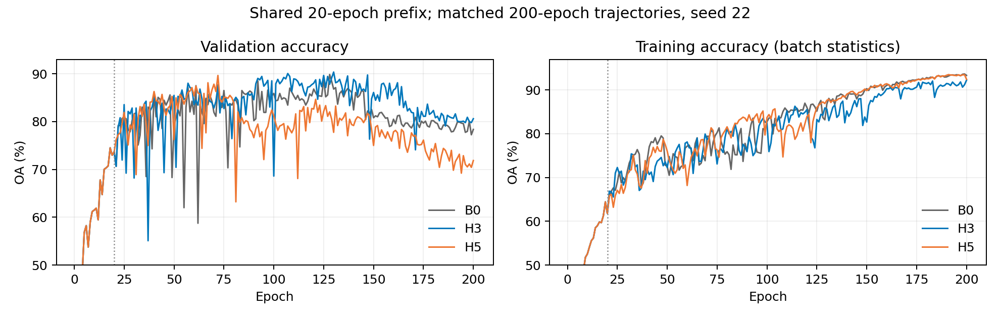

**读图：** 先指左侧验证曲线的后期下降，再指右侧训练曲线上升。H3相对同协议基础臂test OA提高1.1750个百分点，H5反而低0.2026个百分点。K提高或loss更低，没有自动变成更好分类。

最重要的是基础臂也退化。e200训练日志OA为93.3385%，但同训练集clean/eval仅81.3686%。退化不仅发生在未见验证对象上。

随后发现V4与原HyCoRe同时有三类变化：

| 方面 | 原HyCoRe | V4 | 对判断的影响 |
|---|---|---|---|
| part存储 | 切片视图，采样赋值会复写whole前段 | part独立存储 | 实际网络输入变了 |
| BN | part、whole两次前向都更新 | 仅whole更新运行统计 | 推理统计改变 |
| batch | 实例shuffle32 | 4×8队列，按剩余chunk组织 | 类别时序与负配对改变 |

V4每轮仍覆盖全部8856对象，不能把失常解释为没见过某类。但epoch前段出现类别偏置：e200前20批只出现7类。BN重校使末轮验证78.3537%升到82.5203%，却让best从89.8374%降到87.3984%。这证明评估条件敏感，不能说已经找到一个普适BN修复。

因此V4基础臂不是原HyCoRe复现。V4→V5的首要工作是恢复基础算子，并核对双卡损失和梯度范围；它不是在同一稳定协议上只调HIER超参数。[S12](sources/S12.txt)

### 3.4 V5：恢复原HyCoRe操作，改用官方式类别广度（约6分钟）

V5恢复part视图复写、part→whole两次普通BN更新，以及原FPS与CE/intra数值；采用两卡各16类×2，全局32类×2＝64。同一个global64供CE、intra和HIER，不是只把inter扩大到64。

与4×8相比，32×2让batch覆盖更多类别，却使每个anchor只有一个其他同类位置。HIER要求至少两个非self互惠候选，因而当前合格关系通常包含跨类候选。后期约93.6%的sample j为跨类：**这是协议决定的关系构成，不能把当前训练描述为大量纯类内三元组。**

两组完成200轮×200步：

| V5主运行 | 抽样 | best val OA / epoch | 选中test OA | Test AA |
|---|---|---:|---:|---:|
| V5-B0-32-CAP200 | shuffle32，每轮只取200批 | 94.5122% / 172 | 92.5851% | 89.3285% |
| V5-HIER64-K20-W20 | balanced64，K20，W20 | 94.0041% / 179 | 92.1394% | 89.1581% |

V5没有重现V4那种严重后期推理崩溃，说明基础操作恢复与新协议的联合修改带来了更稳定的训练。但两组的batch与抽样不同，V5-B0-32-CAP200也不是完整原训练协议复现，不能把两者差值当HIER净效应。

**读图：** 此处先看上排V5分类曲线，以及下排代理数值投影比例；下一节再看V6。阴影是20轮base-only。whole贴边统计来自增强训练条件，不能直接代表clean/eval的whole。V5与V6余弦周期不同。

短诊断以覆盖和数值预算选择K20、P512、随机代理及代理LR0.01；这不是通过正式test找到最优K。V5最终仍出现大量代理数值饱和和反向最近四例重复，说明“能稳定训练”还没有变成“结构有效”。[S13](sources/S13.txt)、[S19](sources/S19.txt)、[S20](sources/S20.txt)、[S25](sources/S25.txt)

**过渡句：** 到V5，基础训练至少恢复到可研究的状态。V6先处理了一个确定的关系退化问题，随后补足真正匹配的无HIER对照；V7再处理代理参数越界。

---

## 四、V6—V7：关键改动、主结果和收益边界（30—42分钟）

### 4.1 V6排除self-k，同时补原协议参照和同协议控制

V5沿用了官方负池行为，索引i自己会进入负候选，从而产生i=k。若pair/triple祖先不同，同一端点被两个hinge要求相反的距离差，加正margin后不能同时满足。

$$
[A-B+m]_+ + [B-A+m]_+ \ge 2m
\qquad (m>0).
$$

V5末40轮，这类draw只占约2.10%，却贡献约37.20%的sample loss。因此V6在sample和proxy两图排除索引k=i，有明确纠错理由。相同对象在不同采样位置重复仍可能存在，索引退化与数据ID重复不能混为一谈。

V6同时从200改为300轮，余弦调度周期也延长，增加实际祖先角色、深度和稳定性记录。所以V5→V6不只改变一个因素；loss下降也不等于结构提升。[S22](sources/S22.txt)、[S40](sources/S40.txt)

为了回答“原HyCoRe本身是否正常”，补了B0-32和B0-64；为了回答“balanced64下HIER的增量是什么”，又补了V6-B64：

| 原协议工程参照，按test OA选模型 | 训练数据与抽样 | 预算 | Best test OA | 同权重Test AA |
|---|---|---|---:|---:|
| ORIG-B0-32-S4780 | 全9840，shuffle32，历史seed4780 | 名义300轮 | 94.044% | 91.545% |
| V6-B0-32 | 全9840，shuffle32，seed22 | 300×307步 | 93.841% | 90.812% |
| V6-B0-64 | 全9840，shuffle64，双卡local32 | 300×153步 | 94.1653% | 91.7116% |

ORIG最佳名义轮为e230，保存源码标签229；其历史有早期resume，完整step数未重新验收。ORIG/B0-32数值保留原日志精度。AA是OA选中权重的同轮值，不借用独立最高AA。

这些模型能到约94%，说明原基础路径与原采样global64没有整体失效。但它们使用完整训练集、不同采样步数及逐轮test选模，不能与验证选模的HIER结果直接估计净收益。[S23](sources/S23.txt)、[S26](sources/S26.txt)、[S33](sources/S33.txt)

真正的同协议历史控制是**V6-B64**：从V6共同e20的完整模型、动量、调度、BN、RNG与sampler状态分叉，保持8856/984、balanced64、200步/轮、300轮余弦，只关闭HIER及代理更新。它不是重新训练20轮warmup，也不是只加载模型后重建优化器；不承诺分叉后与历史HIER逐位重放。[S32](sources/S32.txt)

### 4.2 V6→V7：发现的不是margin单位错误，而是参数径向饱和

先分清三个量：

$$
\mathbb B_c^D=\{p:c\|p\|^2<1\},
\qquad
r=\|p\|,
\qquad
d_0(p)=\frac{2}{\sqrt c}\operatorname{atanh}(\sqrt c\,r).
$$

$$
p=\exp_0^c(v)
=\frac{\tanh(\sqrt c\|v\|)}
{\sqrt c\|v\|}\,v,
\qquad
d_0(p)=2\|v\|
\quad\text{（未触发额外截断时）}.
$$

切空间模长是保存参数v的长度；球坐标半径是映射后p的欧氏长度；原点深度是双曲距离。margin0.1作用于**两点非平方双曲距离差**，不是坐标半径差，也不是要求代理深度恰好比whole少0.1。

c=1代理映射后还有半径0.999的数值投影。保存切空间模长超过约3.8002后，输出径向位置被限制：

$$
\|v\|\gtrsim3.8002
\quad\Longrightarrow\quad
p\approx0.999\frac{v}{\|v\|},
\qquad
d_0(p)\approx7.6004.
$$

继续增大保存参数模长，已经不能正常改变实际球内径向位置。V6 e300有323/512代理处于这个区间，全部在当轮sample-inactive组。对已经逐ID检查的297个合格边界inactive代理，末期参数梯度几乎全角向，sample反馈数值上可忽略；这个梯度结论不能泛化为全部512个代理。

这能解释“保存模长很大、输出贴边”，但末期观察不足以倒推最初外移只由proxy项造成。sample-inactive仍可能通过proxy端点或soft选择收到梯度。[S35](sources/S35.txt)、[S40](sources/S40.txt)

### 4.3 为什么没有直接照搬官方cap和梯度放缩

官方HIER前向截切空间模长到2.3，再expmap；球内反向乘inverse-metric因子：

$$
\nabla^{\mathrm{corrected}}_p L
=\frac{(1-c\|p\|^2)^2}{4}\nabla^{\mathrm{Euclidean}}_p L.
$$

它没有每次AdamW更新后约束保存参数。超前向cap后，径向输出近乎平坦；反向放缩不会恢复这条径向导数。对AdamW而言，小梯度也不意味着按相同比例缩小实际参数步幅。

既有受限诊断固定whole、关系与Gumbel流，四臂各32步：

| 已有短诊断观察 | 无界AdamW | 官方前向cap＋输出hook | 更新后参数cap |
|---|---:|---:|---:|
| 梯度范数示例 | 约0.0378 | 约2.62e−6 | 原反向路径 |
| 实际AdamW参数步幅中位数 | 约0.02927 | 约0.02870 | 按更新后约束检查 |
| 参数有效区 | 可越数值投影阈值 | 保存参数仍可超过前向cap | 最大切空间模长约3 |
| 数值投影饱和 | 风险仍在 | 可避0.999投影，但cap外径向近乎平坦 | 该受限窗口为0 |

两种梯度相差很大，步幅却接近；不同臂的有效坐标与轨迹也不同，不能把整个差异只归因于hook。这个短实验回答的是保存参数与映射的安全性，没有检验长期语义结构。[S36](sources/S36.txt)

### 4.4 V7实际改了四方面

| 项目 | V6-HIER64-K20-W20 | V7-HIER64-K20-W0 | 改动理由 |
|---|---|---|---|
| HIER启用 | 前20轮关闭 | 首次更新就启用 | 检查早期共同适应，取消base-only等待 |
| HIER权重 | 0.5 | 0.1 | 降低对分类/intra共享参数的加权扰动 |
| 初始化 | 官方式随机切空间范数 | 随机方向、统一精确内部深度 | 起始保持在实测whole中位深度内侧 |
| 参数约束 | 无更新后范数约束 | AdamW后切空间模长≤3 | 避免保存参数进入数值投影饱和区 |

初始化校准用零更新新模型的16批whole，恢复BN/RNG。实测whole中位深度2.488942：

$$
d_{\mathrm{init}}=\min(5,0.9m_0)=2.240048.
$$

因此实际初始化不是固定深度5；5会超过当时whole的中位深度。更新后约束对应：

$$
\|v_p\|\le3,\qquad
d_0(p)\le6,\qquad
\|p\|\le\tanh(3)\approx0.99505475.
$$

只收回超限代理，保留方向；没有统一放缩全部代理，没有给whole新增2.3截断，也没有新增反向hook。c1/D256、P512、K20、T50、margin/tau0.1、原模型与代理优化器及基础协议保留。唯一完整训练300×200步；四方面同时改变，不能从这一条训练拆出各自贡献。[S36](sources/S36.txt)、[S37](sources/S37.txt)

### 4.5 主结果：分类回升，结构收益仍需分开看

| 验证选模的主实验 | best epoch | Val OA | Test OA | Test AA |
|---|---:|---:|---:|---:|
| V5-B0-32-CAP200 | 172 | 94.5122% | 92.5851% | 89.3285% |
| V5-HIER64-K20-W20 | 179 | 94.0041% | 92.1394% | 89.1581% |
| V6-B64，同协议历史控制 | 231 | 94.3089% | 91.8558% | 89.9994% |
| V6-HIER64-K20-W20 | 99 | 94.3089% | 91.2480% | 88.9169% |
| V7-HIER64-K20-W0 | 187 | 93.8008% | 92.2204% | 89.7204% |

这里的test是**验证选中权重**在2468个官方测试对象上的最终结果，不是e200/e300末轮成绩。V5总预算200轮，V6/V7为300轮；V5-B0-32不是匹配global64控制。

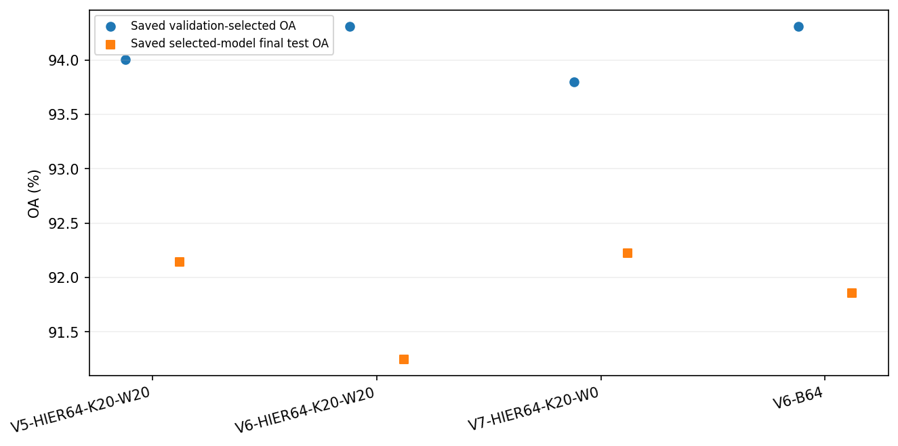

V6-B64比V6-HIER64高0.6078 OA点，对应15个对象。V7比V6-HIER64高0.9724点，即24个对象；比V6-B64高0.3647点，即9个对象；比V5-HIER64高0.0810点，即2个对象。

但V7最高验证OA比V6/B64低0.5081点，test AA也比B64低0.2791点。可以说联合修改后测试OA回升，不能说已稳定超过无HIER基线；单seed、多因素、历史对照也不能提供各改动的独立因果收益。[S19](sources/S19.txt)、[S22](sources/S22.txt)、[S32](sources/S32.txt)、[S37](sources/S37.txt)、[S40](sources/S40.txt)

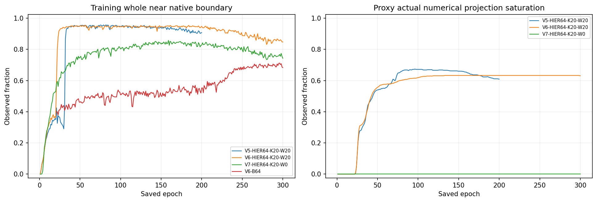

**读图：** 右图V7代理数值饱和始终为0，V6末期约323/512。左图whole近边界比例仍较高，无HIER的B64也有该现象；这些是训练模式统计，不是clean/eval分布。

共同e300，V6→V7的sample祖先188→267，有效代理数155.46→197.59，但raw NN4覆盖28→27。V7联合修改改善了数值状态与参与范围，热点问题没有随之解决；不能将参与范围增量单独归给参数cap。

**过渡句：** 接下来把分类成绩暂时放在一边，检查V7究竟组织了什么。首先区分“代理被样本选为祖先”与“代理反向检索出四个样本”。

---

## 五、V7：代理分层、方向关系与持续热点（42—56分钟）

### 5.1 三种统计口径必须分清

| 观察 | 问题是什么 | 不能直接推出什么 |
|---|---|---|
| sample祖先使用 | 当轮某代理是否被样本pair/triple选中 | 未选中不等于没有任何梯度 |
| 正hinge / 分项梯度 | 某关系是否需要优化、哪个损失给代理梯度 | 梯度不等于实际AdamW位移 |
| proxy→whole NN4 | 固定代理反向查询全样本池的四个近邻 | NN4不是训练记录中的后代关系 |

后文V7“used”统一指当轮sample、非碰撞pair＋triple至少使用一次，**不额外保证positive hinge**。原版图像回放的“有效祖先”则有正hinge门槛；两组计数定义不同。只有说清楚分母和角色，才能讨论深层代理是不是休眠。

固定batch之后，热点在现有版本中持续存在，但并不是到V7才出现。V6 e20尚未启用HIER，代理数值饱和为0，已经有477/512代理共享同一四元组，全体NN4只覆盖7个对象。它早于HIER联合更新和代理数值饱和，不能直接把“batch固定后持续看到”说成“batch已被证明造成”。[S40](sources/S40.txt)

### 5.2 V7代理很早分成浅层used与深层inactive

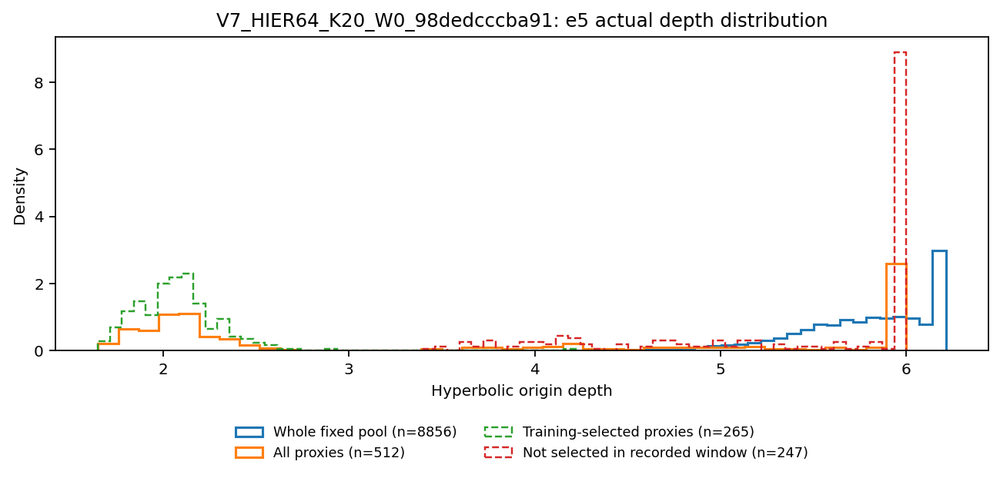

**读图：** 蓝色是8856个clean whole，橙色是全部512代理，绿虚线是当轮sample-used，红虚线是sample-inactive。此处浅层代理多被使用，深层代理多未被使用。两群是**使用状态分化**，不能命名为pair层和triple层。

| 快照 | sample-used数量 | used深度中位数 | inactive深度中位数 | whole深度中位数 |
|---|---:|---:|---:|---:|
| e1 | 512 | 2.399 | 无此组 | 4.662 |
| e5 | 265 | 2.066 | 6.000 | 5.838 |
| e20 | 229 | 1.967 | 6.000 | 5.537 |
| best e187 | 285 | 2.182 | 6.000 | 5.389 |
| e200 | 275 | 2.208 | 6.000 | 5.138 |
| e300 | 267 | 2.272 | 5.939 | 4.808 |

e300使用组的深度范围2.107—2.946，未使用组3.397—6.000，径向分组非常明显。但每一行是当轮分组，不能仅凭各轮中位数类似就认为始终是同一批代理。

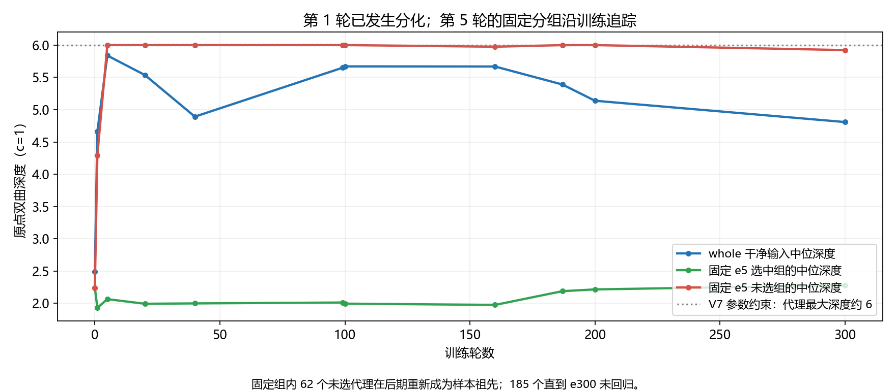

固定e5未选中的247个代理追踪：62个后期恢复sample选择，185个直到e300未恢复；31个恢复者e5已经到深度cap6。e5未使用组还有100个浅于whole中位数，因此没有代码上的“比whole深就永久排除”规则。

更合理的描述是：**大量代理在共同祖先竞争中长期处于劣势，sample反馈很弱；确有再激活，因此不是不可逆的硬退出。** 全程重新激活次数也比V6丰富。sample-inactive仍可能从proxy项查询端点、代理祖先或ST软选择获得梯度。[S40](sources/S40.txt)、[S42](sources/S42.txt)、[S44](sources/S44.txt)、[激活子集补充](sources/V7_active_geometry.json)

为什么深度更靠近whole仍不被选？因为HIER选的是多个端点的最大距离，不是原点深度差。若方向偏离，深代理到几个端点可能同时更远；较浅的代理反而可成为多个方向的共同近祖先。

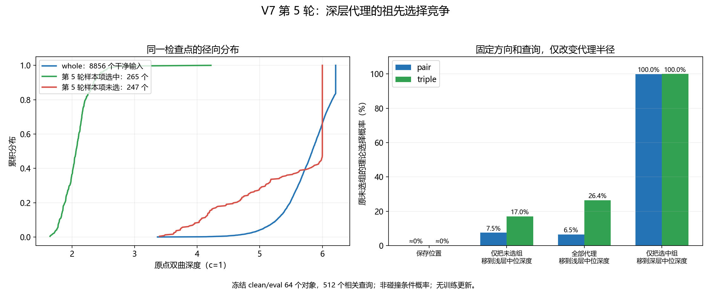

既有冻结控制保持64对象、查询和方向不变，把247个未使用代理移动到浅群中位深度，非碰撞pair/triple选择概率从约零升到7.506%/16.963%。这支持径向竞争参与休眠，但没有更新网络，也不能证明这是长期外移的唯一训练原因。[S42](sources/S42.txt)

### 5.3 whole方向早已分类分离，代理没有形成稳定类别绑定

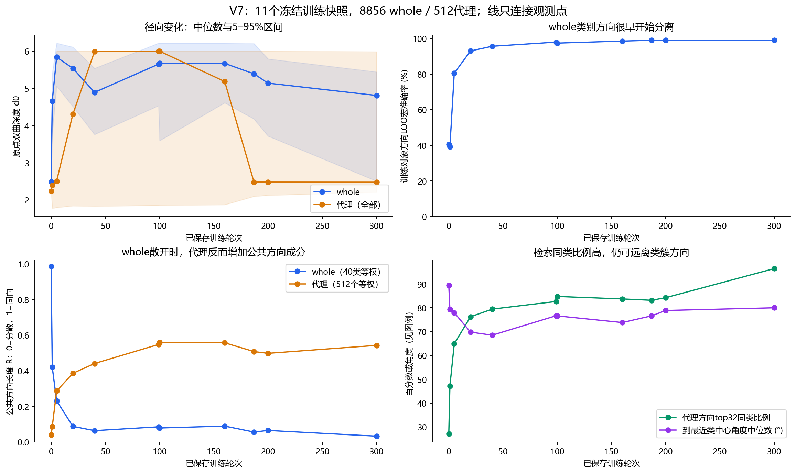

**读图：** 右上是训练嵌入的LOO方向宏准确率，不是正式测试分类结果。左下whole按40类等权，代理按512个等权；不能混作同一人群。右下角度曲线是全512代理，下文另列仅used统计。全代理中位数受双峰两群比例影响，也不是每个代理都集体内移。

whole在e1类别中心已打开，但类内也散；e5方向LOO宏准确率80.50%，e20为92.98%，e300为98.96%。末期类内平均cos0.990、类间宏平均cos−0.024，whole没有整体方向坍缩。

与此同时，代理全体公共方向长度从初始化约0.041增至e300约0.543。类别nearest标签会变动，固定代理ID从e5到e300只有1.95%保持相同最近类中心。它有阶段性方向亲和，但不能说持续跟随某个类别形成稳定分支。[S44](sources/S44.txt)

### 5.4 只看已激活代理：更像类间祖先，是解释而非已证实结论

按用户关心的口径，只看e300当轮267个sample-used代理，已有补充统计是：

| e300统计 | used 267个 | inactive 245个 |
|---|---:|---:|
| 深度中位数 | 2.2717 | 5.9392 |
| 到最近类方向中心夹角中位数 | **76.081°** | 80.042° |
| 夹角平均值 | **70.029°** | 79.585° |
| 夹角5%分位数 | **36.593°** | 78.030° |
| 最小夹角 | **22.666°** | 51.745° |
| 方向top32主类别平均纯度 | **95.751%** | 97.219% |

角度是在原点比较单位方向。类方向中心是类内单位whole的均值再归一化；“最近类别”是40个中心中夹角最小者：

$$
u_p=\frac{p}{\|p\|},\qquad
\bar u_a=
\frac{\operatorname{mean}_{i:y_i=a}(u_i)}
{\|\operatorname{mean}_{i:y_i=a}(u_i)\|},
\qquad
\theta_{pa}=\arccos(u_p^\top\bar u_a).
$$

$$
a^*(p)=\arg\min_a\theta_{pa}.
$$

最近类别是相对标签，不是代理属于该类。76°也不是二维画面中的角度，而是256维空间的原点夹角；应结合类方向锥和高维参考解释。既有90%方向锥检查中，没有代理进入其最近类别方向锥，used子集也包含在这一结论中。

这支持“已激活代理大多不与类簇方向重合，更像较粗的跨方向祖先”这一解释。但祖先本来可以位于叶子簇外，不能因为不重合就宣布失败，也不能仅凭这点确认它已经编码有意义的类间共性。尤其当前32类×2的关系池偏跨类，类内软结构仍需独立验证。[S25](sources/S25.txt)、[S45](sources/S45.txt)、[激活子集补充](sources/V7_active_geometry.json)

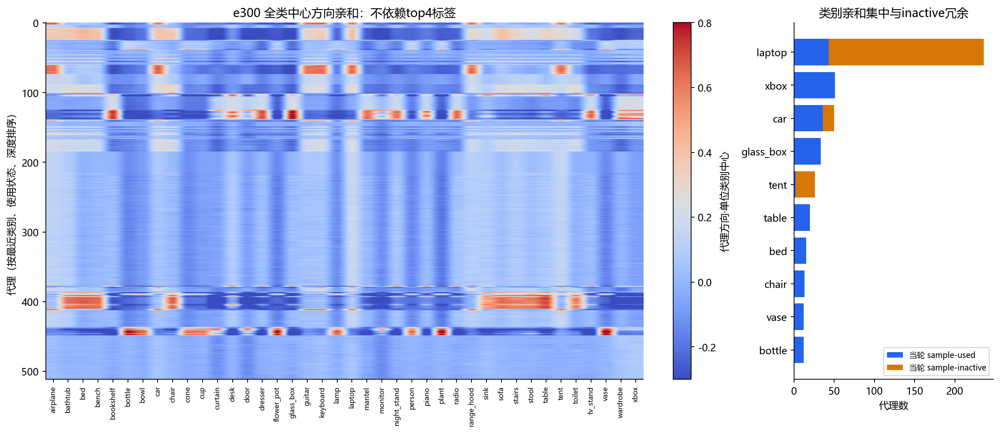

**读图：** 右侧蓝色只表示sample-used，橙色是sample-inactive。e300相对最近laptop的代理236个，其中used43、inactive193。那193个的方向集中度R=0.9768属于休眠组证据，不能拿来证明已激活代理整体坍缩。43个used的R为0.6608。左侧热图展示全512，不替代上面的used表。

### 5.5 热点有两层：极浅whole优势，以及代理方向冗余

V7末期全512代理的raw NN4覆盖27个对象；最热四个都是flower_pot，占1648/2048槽位，即80.47%。flower_pot全类共有134对象，占候选池1.51%，却获得1805槽位，即88.13%；raw只涉及该类6个对象。

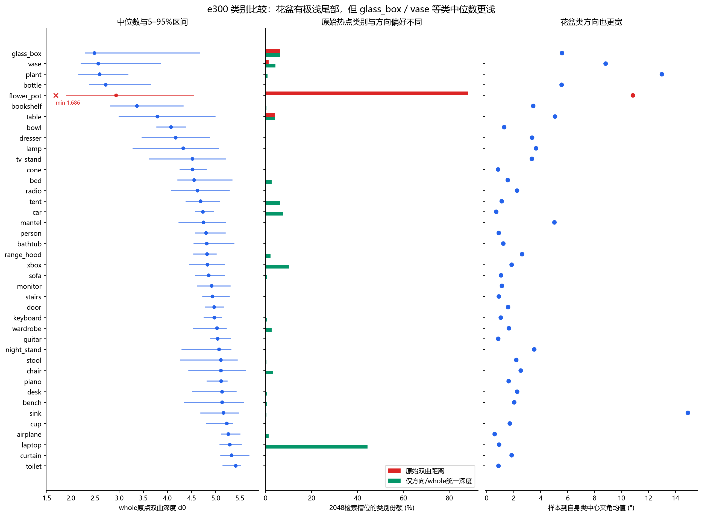

**读图：** 区分类别中位数与最浅尾部。花盆不是中位深度最浅的类别，但全局最浅四例都来自花盆。也区分raw槽位与纯方向槽位：花盆raw1805，direction仅1；laptop反而占direction909槽。

保持全部代理位置和whole方向，只统一whole深度，既有控制结果：

| V7 e300反向NN4 | 原始whole深度 | whole统一深度 |
|---|---:|---:|
| 全512代理覆盖对象 | 27 | 221 |
| 最大重复同一四元组 | 287/512 | 45/512 |
| 最热四对象槽位份额 | 80.47% | 28.08% |
| 仅267个used代理覆盖 | 26 | 172 |
| used最大重复四元组 | 133/267 | 17/267 |

全候选、同深whole下，固定非零代理的距离排名等于方向cos排名；统一深度2、4.808或6给相同排名。它们不是三个独立发现。深度分别约2.160与6.000、方向相隔98.507°的两个代理，也可以共享原始同一热点四例，说明共享热点不要求代理坐标重合。[S43](sources/S43.txt)

完整双曲距离包含径向和角度。c=1时：

$$
\cosh d(p,x)
=\cosh d_0(p)\cosh d_0(x)
-\sinh d_0(p)\sinh d_0(x)\cos\theta.
$$

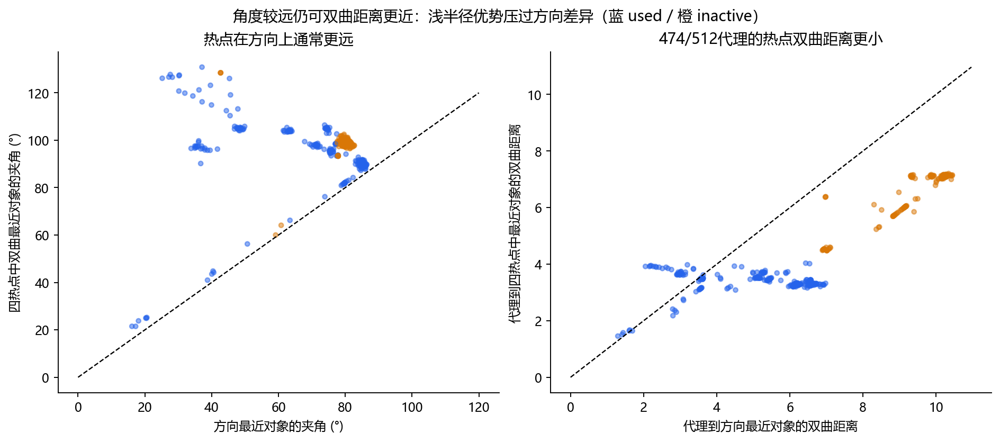

474/512代理到四热点中最近者的距离，比到自己“方向最近对象”的距离还小，典型优势中位3.017。热点夹角中位97.98°，方向最近对象79.78°；但后者深度中位5.087，热点仅1.686—1.799。这是径向优势盖过方向接近的直接冻结证据。

统一whole后仍只覆盖221对象，laptop占909槽、只涉及32对象；加上未使用代理方向冗余，说明热点不全是半径问题。保留代理半径、随机化代理方向的已有五seed控制，等深覆盖1210—1295，raw反而只有5。径向与方向排布有交互，不能直接把“随机化覆盖更高”变成推荐随机重置代理训练。[S44](sources/S44.txt)、[S45](sources/S45.txt)

### 5.6 四个最热样本并非从一开始就浅，也不是原HyCoRe中天然浅

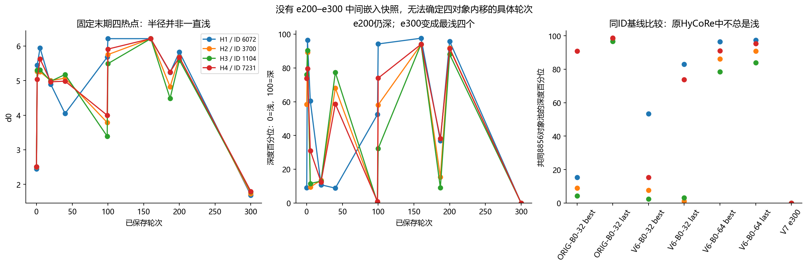

| 末期热点匿名对象 | V7 e200深度 | V7 e300深度 | e300浅度排名/8856 | 原HyCoRe last同ID排名/8856 |
|---|---:|---:|---:|---:|
| H1 | 5.827 | 1.686 | 1 | 8712 |
| H2 | 5.681 | 1.730 | 2 | 8714 |
| H3 | 5.592 | 1.786 | 3 | 8558 |
| H4 | 5.670 | 1.799 | 4 | 8753 |

e200四个对象raw槽位都是0，到e300才变成全局最浅四例；同ID在原HyCoRe末期反而接近最深端。我们只能把剧烈径向重排定位在e200—e300区间，缺少中间嵌入，不能指出具体发生轮次。

花盆方向较宽在几个原HyCoRe基线中也存在，但极浅尾部并非共同现象；最热四例本身都分类正确。它们不是由“最难分类样本”这个单一条件解释的。

目前还不知道什么训练力使这四例在后期大幅向内移动。反向NN4不参与训练mining，不能从热点图直接推导“它们因反复被代理检索而不断受吸引”的因果循环。[S44](sources/S44.txt)

**过渡句：** 这时回到原版HIER就很关键。我们原先觉得它1647/1664个覆盖很分散，但现在拿到了真实best和完整缓存，可以检查这种差异到底来自whole，还是来自proxy。

---

## 六、原版HIER三数据集与V7：好对照，也有反例（56—70分钟）

### 6.1 审查对象与可比较范围

同学提供CUB best e17、Cars best e45、SOP best e96，及train/eval、两个增强视图的完整缓存。核对checkpoint身份、样本标签、官方映射和距离；之后又完成三数据集真实增强图像的无更新一轮长度回放。

| 模型 | train对象数 | train类别数 | 空间 | 代理 |
|---|---:|---:|---|---:|
| 原版HIER CUB | 5864 | 100 | c0.1，D512 | 512 |
| 原版HIER Cars | 8054 | 98 | c0.1，D512 | 512 |
| 原版HIER SOP | 59551 | 11318 | c0.1，D512 | 512 |
| V7 ModelNet40 | 8856 | 40 | c1，D256 | 512 |

这是几何机制对照，不是相同数据、主目标、曲率和训练预算的算法胜负比较。原版best也只代表此次拿到的best检查点；不能称所有可能训练中理论最优的嵌入分布。[S45](sources/S45.txt)、[S46](sources/S46.txt)

### 6.2 最重要的新认识：原版whole几乎全在同深薄壳

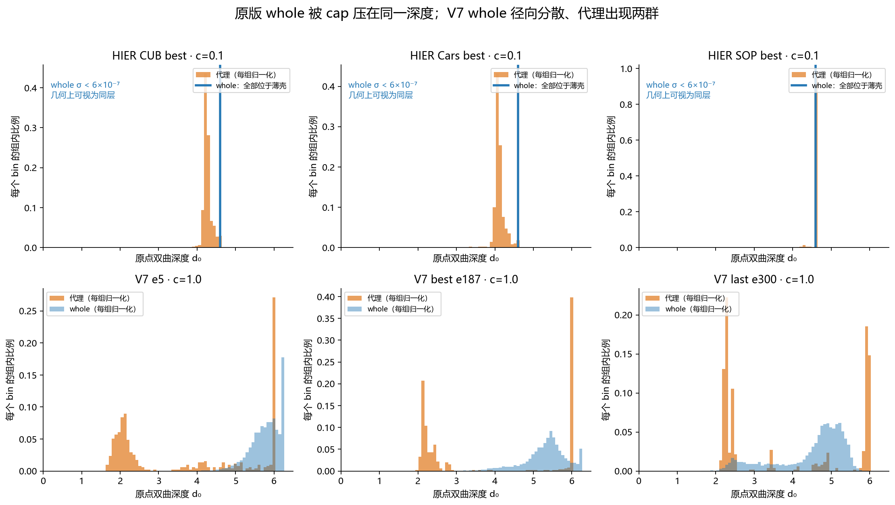

**读图顺序：** 上排CUB、Cars、SOP的蓝色whole都是一根薄壳线；CUB/Cars橙色代理稍浅，SOP橙色代理几乎也压到同壳。下排V7 e5、best187、e300的whole径向明显分散，代理有浅深双峰。纵轴每组归一化、各面板范围不同；横轴共用深度刻度，但不同曲率的裸深度不代表同等空间利用。

| clean train模型 | whole深度范围 | 中位数 | 标准差 | 方差 |
|---|---|---:|---:|---:|
| CUB best | 4.59999725—4.59999933 | 4.59999782 | 5.30e−7 | 2.81e−13 |
| Cars best | 4.59999718—4.59999934 | 4.59999785 | 5.59e−7 | 3.13e−13 |
| SOP best | 4.59999784—4.59999981 | 4.59999870 | 3.02e−7 | 9.14e−14 |
| V7 e5 | 3.36651—6.21262 | 5.83791 | 0.38188 | 0.14583 |
| V7 best e187 | 2.57888—6.21262 | 5.38916 | 0.56035 | 0.31400 |
| V7 e300 | 1.68630—5.88518 | 4.80800 | 0.90563 | 0.82017 |

原版所有12个缓存视图的whole都在深度4.6上限附近，波动只到FP32数值尺度，没有有意义的径向分散。此前“原版没有约束whole半径，所以应当径向分散”的猜想，需要被这批原始数据修正。

原因是官方样本和代理映射前都有切空间cap2.3：

$$
\|v\|\le2.3
\quad\Longrightarrow\quad
d_{0,\max}=4.6.
$$

c0.1时，最大坐标半径约1.9651，球边界约3.1623；“球边界还有空间”不等于当前模型允许使用全部径向深度。cap确实限制表示范围，同时改变径向优化；是否损失有用表达，需要任务证据，不能只从画面大小判断。

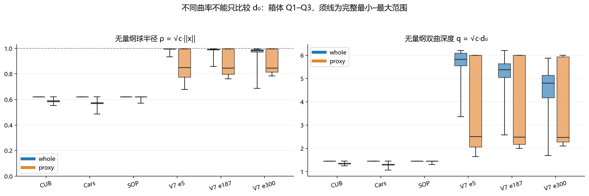

不同曲率需要同时看：

$$
\rho=\sqrt c\,r,
\qquad
q=\sqrt c\,d_0.
$$

不能把c0.1的深度4.6与c1的4.8直接解释为后者更充分利用空间。本次原版的关键差别是**whole径向近乎同层**，而非某个裸深度数更大或更小。[S45](sources/S45.txt)

### 6.3 原版代理：CUB/Cars稍浅且方向分散，SOP贴cap并集中

| 代理指标 | CUB best | Cars best | SOP best | V7 e300 |
|---|---:|---:|---:|---:|
| 深度中位数，全512 | 4.24684 | 4.09347 | 4.59998 | 2.48104 |
| 深度范围 | 3.93189—4.59998 | 3.36414—4.59998 | 4.10971—4.59999 | 2.10691—6.00000 |
| 深度标准差 | 0.10335 | 0.12894 | 0.05011 | 1.70760 |
| 单位方向集中度R | 0.04375 | 0.04708 | 0.64822 | 0.54279 |
| 原参数超过官方前向cap2.3 | 9/512 | 1/512 | 497/512 | 不使用同一cap规则 |
| 代理数值投影饱和 | 不与V7口径合并 | 不与V7口径合并 | 不与V7口径合并 | 0/512 |

V7全体深度中位2.481不代表每个代理浅；应回到used2.272、inactive5.939分组。官方forward cap外与V7数值投影饱和也不是同一事件。

方向集中度定义为单位方向平均向量的长度：

$$
R=\left\|\frac1P\sum_{p=1}^{P}u_p\right\|.
$$

它不是任意一对代理的余弦。对于等权代理，平均非self两两余弦为：

$$
\overline{\cos}_{p\ne q}
=\frac{PR^2-1}{P-1}.
$$

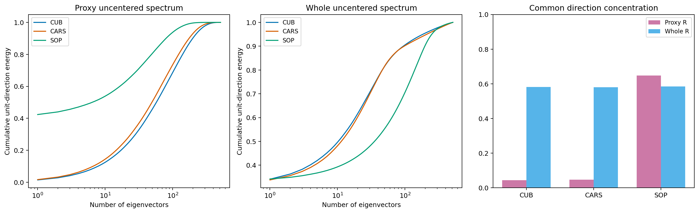

CUB/Cars代理两两cos中位约−0.0069/−0.0089，方向接近分散；SOP中位0.4114，全部非self代理对cos都为正。SOP第一主方向能量42.36%，有效秩30.94，明显有共同方向。但去掉共同分量后仍有剩余方向结构，不能说512个代理完全重合。[S45](sources/S45.txt)、[S46](sources/S46.txt)

### 6.4 原版也存在热点：SOP是重要反例

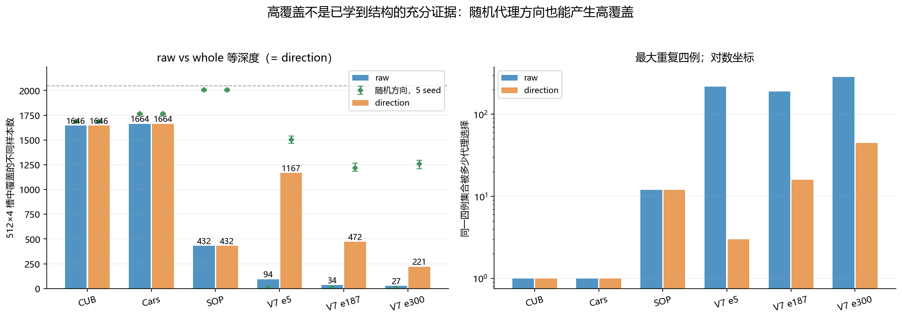

| NN4固定池指标 | CUB | Cars | SOP | V7 e300 |
|---|---:|---:|---:|---:|
| raw无重复对象数 | 1647 | 1664 | 432 | 27 |
| whole等深后的无重复对象数 | 约1647 | 1664 | 432 | 221 |
| raw最大重复四元组 | 1 | 1 | 12 | 287 |
| raw最热四对象槽位份额 | 0.93% | 0.93% | 35.25% | 80.47% |

原版raw覆盖采用未修改官方FP32口径；严格FP64复算CUB为1646，仅1/512代理近并列舍入不同，Cars/SOP一致。图18的严格FP64 CUB点因此可能显示1646，和表中1647不是一次新的实验退化。

512代理各查四例，一共只有2048槽。1647/1664说明重复少，不意味着覆盖全部训练集；“最大重复四元组为1”表示没有完全相同的四成员集合重复，不表示不同代理之间绝无单个样本重叠。

原版whole近乎同深，所以统一whole并不明显改变覆盖。**原版CUB/Cars没有显著热点，SOP本身有方向热点；V7有显著径向热点，同时还有残余方向热点。** 这比“原版没有、我们的代码有”更准确。[S45](sources/S45.txt)、[S46](sources/S46.txt)

这里将原版best与V7末期放在一起，是为了突出机制；V7验证选中的best e187也已经有热点：raw覆盖34，whole等深后472，最大重复四元组191→16。因此热点不只是e300最后一轮的特殊现象，也存在于分类选中的V7权重。[S45](sources/S45.txt)

原版三个数据集也没有代理进入最近细类的90%方向锥。最近类中心角度中位CUB85.91°、Cars86.53°、SOP74.89°；同维度随机参考约85.4°、85.3°、82.6°。CUB/Cars裸角度大，本来就接近高维随机参考；它们覆盖好并不意味着代理位于类内。

所以“代理与类中心不重合”不是V7独有问题，也不是充分失效判据。V7已激活代理是否有有用的类间祖先，需要验证端点关系和语义，不能通过二维投影印象下结论。[S45](sources/S45.txt)、[S46](sources/S46.txt)

### 6.5 SOP控制实验拆出共同方向与相对朝向

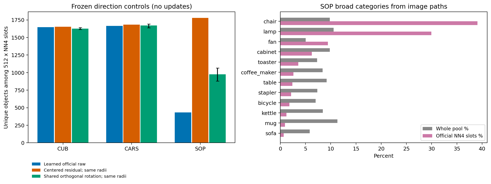

| 保持代理半径的冻结控制 | CUB覆盖 | Cars覆盖 | SOP覆盖 |
|---|---:|---:|---:|
| 原学习代理，官方距离 | 1647 | 1664 | 432 |
| 整组代理正交旋转，五次范围 | 1614—1640 | 1638—1691 | 880—1065 |
| 减去共同方向再归一化 | 1654 | 1683 | 1778 |

正交旋转保留代理间全部夹角、R和各自半径，只改变它们相对whole的朝向；SOP覆盖已经提高。因此不能只用代理内部集中度解释所有热点。减去共同方向进一步扩大覆盖，说明共同分量和相对朝向都参与检索集中。

SOP最热四例是2个chair、1个lamp、1个fan，更朝向代理共同方向，也更处于自己细类的外围。chair占候选池9.82%，占NN4槽39.06%；lamp为10.59%对29.93%。原版SOP的whole同深，不能把这种富集解释为某些whole更浅。

但减均值控制的同细类纯度从0.4048降至0.3594，四例全同细类代理8→4。覆盖更广并不自动变成更好的语义组织；这些控制只改变冻结检索，没有训练更新和任务性能验证。[S46](sources/S46.txt)

### 6.6 热点不等于未训练：真实图像回放全部512被sample有效使用

为了检查“有没有代理被whole或proxy项激活”，已经下载三个图像集，完成源式增强、global180、K20、T50的一轮长度回放：CUB32批、Cars44批、SOP330批。**全过程零优化器更新**，网络、BN与lcas保持不变；不是再训练一轮后的性能。

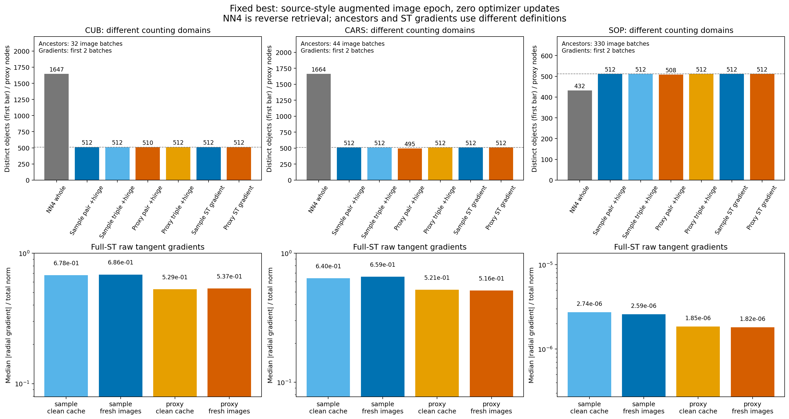

| 完整图像窗口指标 | CUB | Cars | SOP |
|---|---:|---:|---:|
| sample pair有效祖先，非碰撞且正hinge | 512 | 512 | 512 |
| sample triple有效祖先 | 512 | 512 | 512 |
| proxy pair有效祖先 | 510 | 495 | 508 |
| proxy triple有效祖先 | 512 | 512 | 512 |
| 前2批sample full-ST梯度超过1e−8 | 512 | 512 | 512 |
| 前2批proxy full-ST梯度超过1e−8 | 512 | 512 | 512 |
| sample径向梯度占比中位数 | 0.6858 | 0.6595 | 2.59e−6 |
| proxy径向梯度占比中位数 | 0.5369 | 0.5156 | 1.82e−6 |

**读图：** 上排灰柱NN4数的是不同样本，其他柱数的是代理；两种计数不能当作同一种覆盖。祖先覆盖来自整轮窗口，梯度只来自前2批。下排SOP纵轴与另外两组不同，读数值而非柱高。

原版SOP虽然NN4只覆盖432对象，sample有效祖先却全部512。它不是大片代理完全没训练。其径向导数几乎被forward cap压平，但仍有角向梯度。

原版HIER的ST软选择、proxy查询端点和祖先角色会给不同路径的梯度，必须区分“选中”“正hinge”“收到梯度”。V7深层的长期sample休眠，与原版SOP的forward cap外径向极弱，是两个相关但不能混为一谈的现象。[S46](sources/S46.txt)

### 6.7 pair/triple有条件角色，未形成固定两层代理

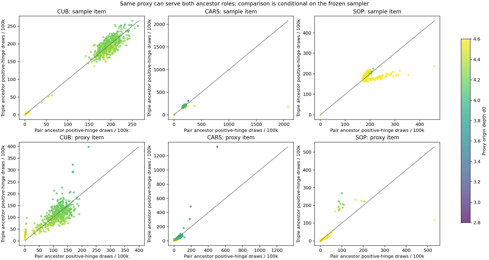

在冻结clean缓存的一轮长度窗口中，原版CUB/Cars的sample pair/triple角色集合完全重叠，SOP也完全重叠。SOP正hinge抽样加权深度pair4.59141、triple4.59120，几乎同深；proxy分项有较弱的深度差，但角色集合Jaccard约0.994。这些深度与重叠值来自缓存窗口，与上一节真实图像窗口分别记录。

一个代理可以在不同三元组中扮演不同祖先角色。HIER代码没有预设512代理的固定pair层和triple层；不能把“存在pair/triple变量”当作两层树已形成，也不能把V7的浅深双峰认定为这种语义层级。[S46](sources/S46.txt)

### 6.8 原版对照给出的解释范围

| 现象 | CUB/Cars原版 | SOP原版 | V7 |
|---|---|---|---|
| whole径向 | 近同深薄壳 | 近同深薄壳 | 有明显分散与极浅尾部 |
| proxy方向 | 分散 | 共同分量明显 | 有冗余，尤以inactive组为甚 |
| 反向NN4热点 | 弱 | 明显方向热点 | 强径向热点＋残余方向热点 |
| sample祖先参与 | 图像窗口512 | 图像窗口512 | e300当轮used267，定义不同 |
| 固定pair/triple分层 | 不支持 | 不支持 | 浅深群主要对应使用状态 |

还需要承认训练混杂：CUB/Cars初始LR1e−4、WD0.01；SOP为LR6e−4、WD0.0001，best轮次和每轮步数也不同。不能把SOP与另外两组的差异全部归因于数据域。

真实图像回放保持原best，使用冻结BN与正确下一轮sampler索引，HIER梯度统一CPU FP32；没有恢复缺失的历史RNG，也不能复原原训练CUDA AMP的每一步。checkpoint缺PA分类代理，不能严格续训原主目标。我们得到的是可信的**条件几何与损失响应证据**，不是训练时间因果链。[S46](sources/S46.txt)

**过渡句：** 原版审查把问题收窄了：径向差异足以制造V7的一类热点，方向排布又能在等深样本上制造另一类热点。下一步不该把所有问题压成一个“调代理半径”的超参数问题。

---

## 七、现有假设：怎样验证并解决热点（70—75分钟）

### 7.1 四个待验证机制，按既有计划排序

以下是已有04/25/40/42—46材料中的研究方向，本次只整理，没有新设训练矩阵。

| 假设 | 已有支持 | 还缺什么 | 下一步已有方向 |
|---|---|---|---|
| **径向偏置让极浅whole压过方向关系** | V7等深覆盖27→221；最热四例极浅；474/512距离对照 | 哪一项训练力造成后期径向重排；真实mining是否受同样影响 | 固定ID、query、噪声，检查半径控制关系的增强稳定性和独立形态一致性；通过后才短测只改mining，loss保留原whole |
| **代理公共方向及相对whole朝向造成冗余** | V7等深仍集中；SOP旋转、减均值控制提高覆盖 | sample与proxy项各自如何形成方向群；覆盖提高是否损害结构 | 冻结whole分解两分项、角色与实际更新，再决定仅代理的限定修正 |
| **共同祖先竞争带来极弱反馈与长期休眠** | e5深组径向移位后选择恢复；大量长时间不被sample使用 | 第一次外移的来源；保持数值安全后怎样恢复有用角色 | 固定早期关系、噪声及优化器状态，分解梯度与实际参数位移；保留已有效的V7参数约束 |
| **crop/BN/batch条件改变关系稳定性** | 原HyCoRe与各基线均有train/eval几何差异；local32组成员敏感 | 条件变化是否大于Gumbel自身随机性；是否改变独立关系质量 | 相同对象、负配对和输入，分别隔离crop、BN与重分组，并与重复噪声基线比较 |

不能把等深检索改善直接变成全部whole等深训练：whole还承担原HyCoRe径向intra。也不能把代理随机方向、减均值或均匀分散直接视为已验证修复；原版SOP覆盖改善同时细类纯度下降，提醒我们这些指标有不同含义。[S25](sources/S25.txt)、[S40](sources/S40.txt)、[S42](sources/S42.txt)、[S43](sources/S43.txt)、[S44](sources/S44.txt)、[S46](sources/S46.txt)

### 7.2 什么才算真正取得结构收益

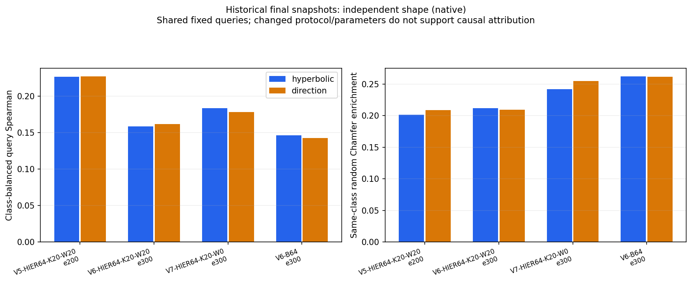

既有审查以同320对象、全8856候选及FPS64点Chamfer作独立几何代理信号。e300结果：

| 独立形态指标 | V7 | 同协议B64 |
|---|---:|---:|
| 类内双曲距离—Chamfer Spearman | 0.1833 | 0.1464 |
| 双曲top4形态gain | 0.2417 | 0.2620 |
| 方向top4形态gain | 0.2550 | 0.2612 |

$$
\mathrm{gain}
=1-
\frac{\text{近邻平均Chamfer}}
{\text{随机同类平均Chamfer}}.
$$

相关性点估计提高，而近邻gain没有全面提高，这不矛盾：前者看较整体的距离排序，后者看局部近邻质量。高同类纯度、低loss、高代理覆盖和较好OA都不能替代独立形态证据；Chamfer本身也不是完整语义层次真值。

下一阶段应同时检查：分类保持、实际祖先关系稳定性、去热点后是否仍有收益、独立形态近邻质量，以及同协议无HIER和多seed。现有工具已经统一了几何、使用生命周期、检索、分项梯度和形态检验，可以复用，不需要每次手工挑几张图。[S38](sources/S38.txt)、[S40](sources/S40.txt)

### 7.3 结束时的陈述

> 我们已经从不稳定移植走到可监察的融合训练。V6修正了退化关系并补足同协议控制；V7防止代理参数进入数值投影饱和区，扩大样本祖先参与，测试OA回升。但这些收益没有自动变成广泛的类内软结构。原版HIER对照显示，whole同深能避免一类径向热点，而SOP即使whole同深也存在代理方向热点。下一步应分别检验关系挖掘的径向偏置、代理方向冗余和早期弱反馈，修复之后仍以独立形态与同协议分类对照验收。

建议向导师讨论的核心决策是：**是否优先验证“半径控制的关系挖掘”，同时保留原whole损失与V7数值约束；还是先定位代理方向冗余的分项来源。** 目前证据支持做聚焦诊断，不支持直接扩大K/P/epoch或一次改很多项。

---

## 附录A：全部主版本的配置演变，供追问时查阅

| 版本/实验 | 数据与batch | 模型更新预算 | 代理与关系 | 重要差异/缺口 |
|---|---|---|---|---|
| LEGACY-V3-IN / INOUT-SCALE3 | 随机初始化；4类×8；有放回；无验证划分 | 名义300×307；现有交接只到e260/262 | P128；e20聚类；K_in3/K_proxy8；分开类内/类间 | W20＋R20；共同norm1裁剪；无matched B0；不是已验收e300最终 |
| LEGACY-V4-B32 | 8856/984；4×8全覆盖队列 | 200×281 | HIER关闭 | 独立part存储；BN1；不是原HyCoRe |
| LEGACY-V4-HIER32 K3/K5 | 同V4基础臂 | 200×281 | P256；e20聚类；sample K3/K5排除self；proxy K20 | W20＋R20；两分项各0.03；margin/tau约0.0316228 |
| V5-B0-32-CAP200 | 8856/984；shuffle32，每轮200批 | 200×200 | 无HIER | 恢复原part/BN；不是完整原协议 |
| V5-HIER64-K20-W20 | 8856/984；32类×2，双卡local32 | 200×200 | P512随机；D256/c1；K20含self；T50 | W20；lambda0.5；无额外cap/hook；源式self-k保留 |
| V6-B0-32 | 全9840；原源码shuffle32 | 300×307 | 无HIER | 按原每轮test选模 |
| V6-B0-64 | 全9840；shuffle64、drop48 | 300×153 | 无HIER | 双卡local32 BN；每轮test选模 |
| V6-HIER64-K20-W20 | 同V5 balanced64 | 300×200 | 保留K20/T50/P512；排除索引self-k | 余弦周期延长；祖先监测更完整 |
| V6-B64 | 同V6 HIER协议，从完整e20分叉 | 300×200含共同前缀；新56000步 | HIER与proxy更新关闭 | validation选模；同协议历史控制 |
| V7-HIER64-K20-W0 | 同V6 balanced64，从头随机初始化 | 300×200 | 深度校准2.240048；更新后参数深度cap6 | W0；lambda0.1；其余基础协议保留 |

V3/V4缩写仅在本表节省宽度，正文与源文件保持完整规范名。V5没有完成现代V5-B64，现代balanced32的B32/HIER32也没有完成主结果。[S09](sources/S09.txt)、[S12](sources/S12.txt)、[S33](sources/S33.txt)、[S36](sources/S36.txt)

## 附录B：V4补充完整结果

| V4旧图例 | 验证选中test OA | 同权重test AA | e200 val OA |
|---|---:|---:|---:|
| B0 → LEGACY-V4-B32-Q4x8-BN1 | 88.3712% | 82.8884% | 78.3537% |
| H3 → LEGACY-V4-HIER32-K3-W20-R20-Q4x8-BN1 | 89.5462% | 84.4878% | 80.5894% |
| H5 → LEGACY-V4-HIER32-K5-W20-R20-Q4x8-BN1 | 88.1686% | 81.4680% | 71.8496% |

OA来自S12；AA来自同次已完成V4审查的原汇总，随包保存于[S-V4完整结果](sources/V4_completed_result_review.txt)。这些是验证选中权重结果，不是末轮test。

## 附录C：三个容易被追问的机制细节

### C1. 原HIER初始化0.9只作用于初始化

$$
v_p\sim\mathcal N(0,I_D)\frac{2.3\times0.9}{\sqrt D}.
$$

范数约集中在2.07，未截断时对应原点深度约4.14。0.9不在后续训练中持续保证代理位于whole内侧。V7则使用实际whole校准，并额外约束保存参数深度上限6；上限也不保证代理一直浅于每个whole。[S25](sources/S25.txt)、[S36](sources/S36.txt)

### C2. 训练日志whole与clean/eval快照不一样

| e300观察条件 | V6-HIER64 | V7-HIER64 | V6-B64 |
|---|---:|---:|---:|
| 增强训练whole近边界比例 | 约84.75% | 约74.30% | 约68.34% |
| 相同8856对象clean/eval深度中位数 | 4.617 | 4.808 | 4.385 |
| clean/eval近边界比例 | 约0.136% | 0% | 0% |

V7训练深度中位约6.213，clean/eval为4.808。crop、增强及BN模式都不同，不能用一张clean图直接解释训练梯度，也不能把训练贴边比例当所有推理whole的分布。[S40](sources/S40.txt)

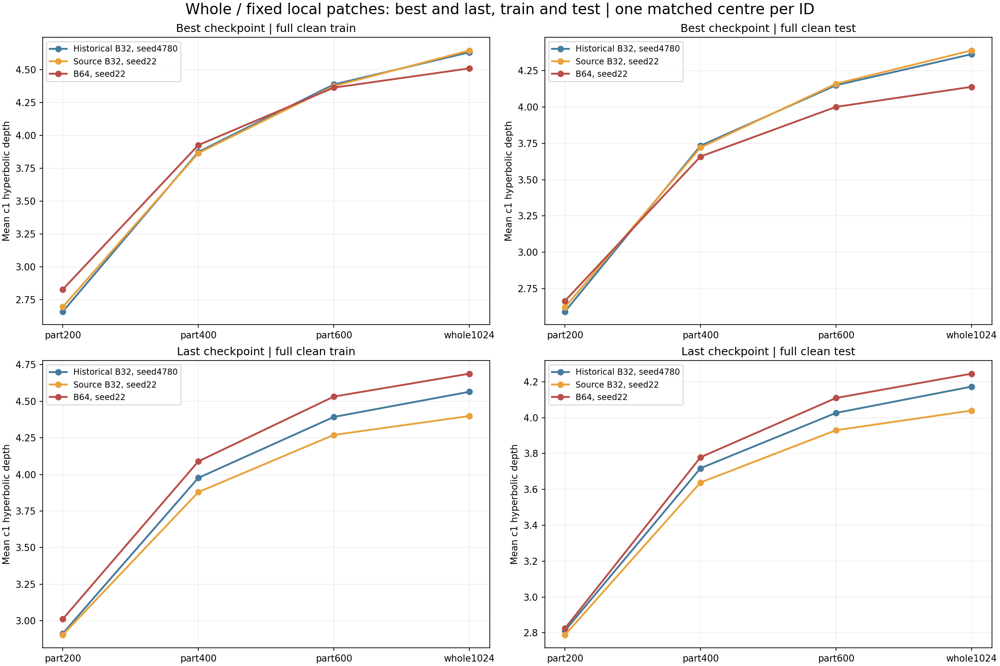

### C3. 梯度增量向内，不代表总更新向内

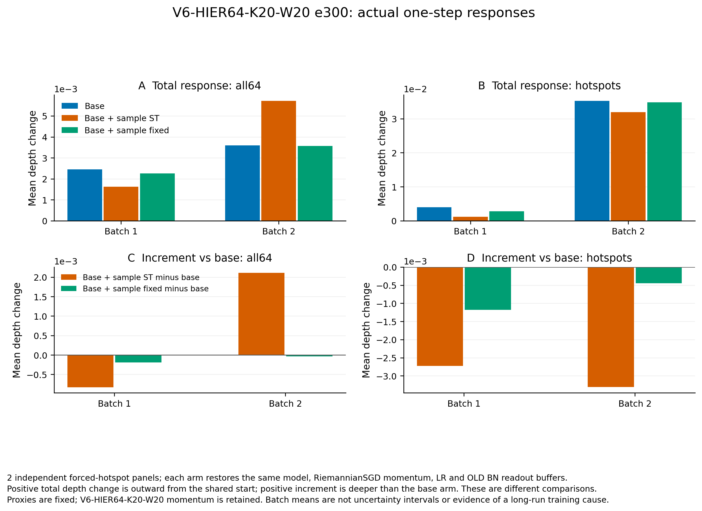

既有条件热点面板中，sample ST相对base的增量可以向内，而含base的总更新仍向外。因此不能只凭某分项偏导，解释长期whole的实际位移。e200统一真实编码器探针的加权HIER/base梯度比V5/V6/V7为3.1141/1.7385/0.2416，支持V7降低局部加权扰动；不代表AdamW代理位移同比下降，也不是全训练期间的因果结论。[S31](sources/S31.txt)、[S40](sources/S40.txt)

## 附录D：备用图与缩放时长

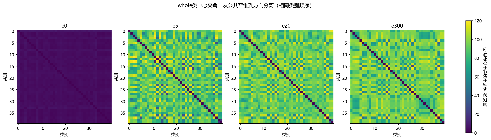

只在导师追问“方向分离是不是PCA造成”时展开。主结论来自原高维角度与LOO统计，二维投影不用于证明严格层次。

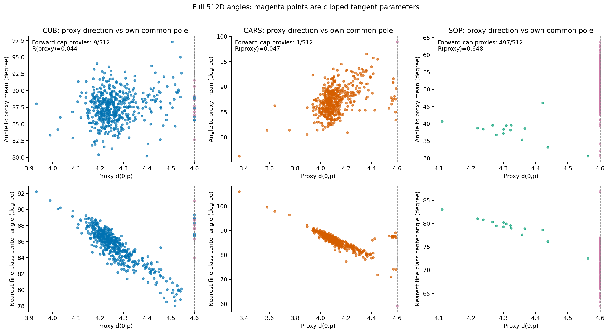

补充CUB/Cars/SOP的代理深度—方向分组。相对最近类别仍不是类归属。

图25按test选模，只作原协议工程参照，不能替代V6-B64同协议控制。

| 汇报长度 | 使用方式 |
|---|---|
| 60分钟 | 一3分钟、二10分钟、三8分钟、四12分钟、五12分钟、六10分钟、七5分钟；省HPCS细节公式、V3逐项参数、原版方向谱与附录 |
| 75分钟 | 使用正文时间表，按图中指定面板讲述，附录只用于追问 |
| 90分钟 | 正文75分钟；追加原HyCoRe/BN几何5分钟、分项梯度与独立形态5分钟、机制假设讨论5分钟 |

## 文献与主要来源

文献链接来自既有S25阅读记录，本次没有新增文献检索：

- Montanaro、Valsesia、Magli，HyCoRe，NeurIPS 2022：[论文页](https://proceedings.neurips.cc/paper_files/paper/2022/hash/da8f9fc2b555d122369f36a9684415c1-Abstract-Conference.html)、[官方代码](https://github.com/diegovalsesia/HyCoRe)。
- Kim、Jeong、Kwak，HIER: Metric Learning Beyond Class Labels via Hierarchical Regularization，CVPR 2023：[论文页](https://openaccess.thecvf.com/content/CVPR2023/html/Kim_HIER_Metric_Learning_Beyond_Class_Labels_via_Hierarchical_Regularization_CVPR_2023_paper.html)、[官方代码](https://github.com/sung-yeon-kim/HIER-CVPR23)。
- Onghena、Gigli、Velasco-Forero，Rotation-Invariant Hierarchical Segmentation on Poincare Ball for 3D Point Cloud，ICCV Workshops 2023，SHARP：[论文页](https://openaccess.thecvf.com/content/ICCV2023W/SHARP/html/Onghena_Rotation-Invariant_Hierarchical_Segmentation_on_Poincare_Ball_for_3D_Point_Cloud_ICCVW_2023_paper.html)、[官方HPCS代码](https://github.com/TheCrossProduct/HPCS)。
- Chami等，From Trees to Continuous Embeddings and Back: Hyperbolic Hierarchical Clustering，NeurIPS 2020：[论文页](https://proceedings.neurips.cc/paper/2020/hash/ac10ec1ace51b2d973cd87973a98d3ab-Abstract.html)。

主要研究来源：[S25理论与适配](sources/S25.txt)、[S12 V4教训](sources/S12.txt)、[S19 V5](sources/S19.txt)、[S22 V5/V6](sources/S22.txt)、[S32匹配控制](sources/S32.txt)、[S36 V7决策](sources/S36.txt)、[S37 V7完成](sources/S37.txt)、[S40系统审查](sources/S40.txt)、[S44 V7方向热点](sources/S44.txt)、[S45原版几何](sources/S45.txt)、[S46原版激活机制](sources/S46.txt)。

全部素材文件、既有来源和原始文件哈希见[素材索引](素材索引.md)及[材料清单](material_manifest.json)。
